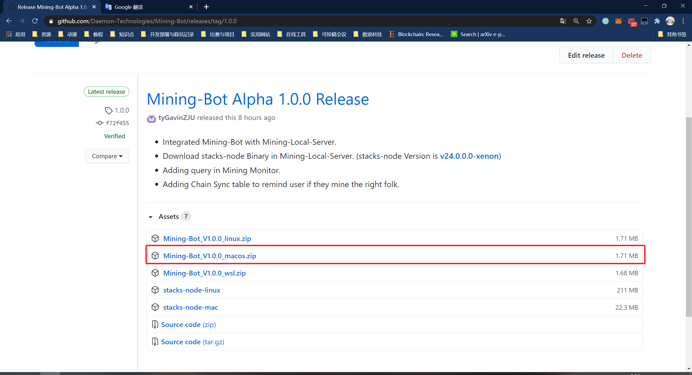
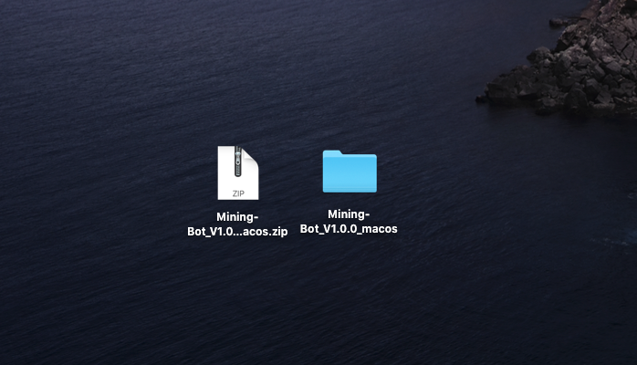
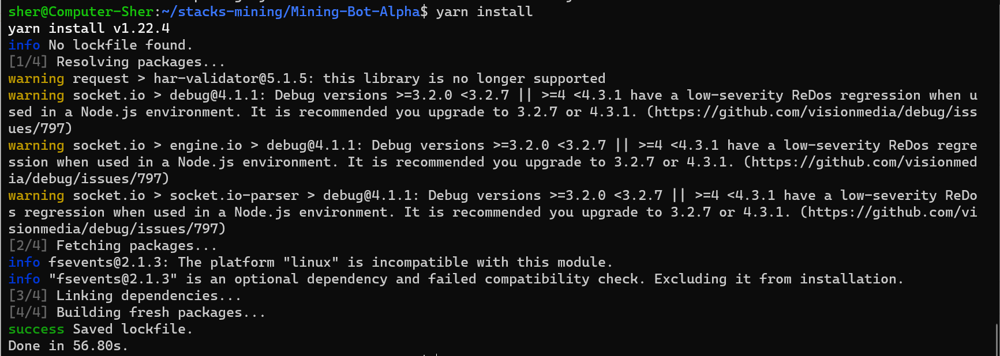
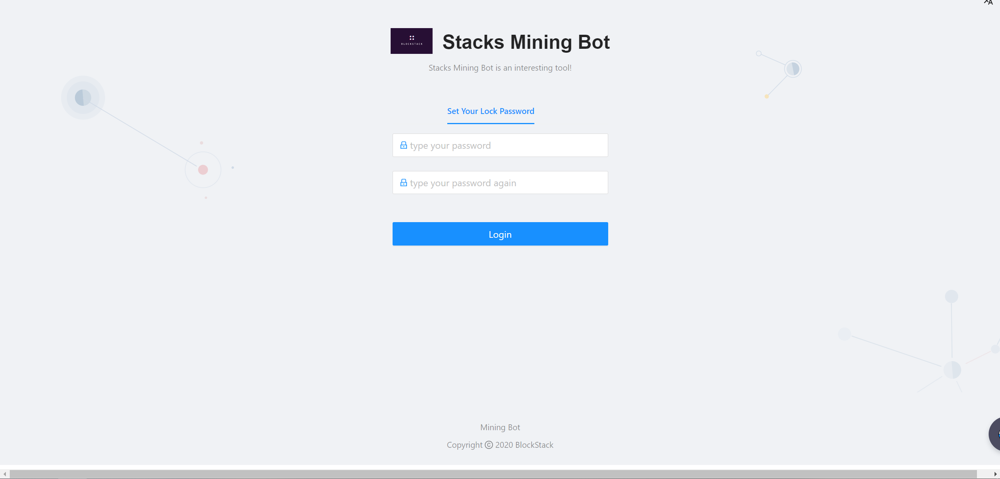

# Building Mining-Bot Before Use

Learn how to set up and run mining bot. 

**【Tips】If you are not the first time to start mining-bot, please see [Restart Mining-Bot](#Restart Mining-Bot)**.

**【Tips】 If you want to get more comprehensive information, please see our tutorial video.**
- [Windows tutorial](https://www.youtube.com/watch?v=FXifFx0Akzc)
- [MacOS tutorial](https://www.youtube.com/watch?v=TCtCTttsSeI)


## Introduction

This tutorial will walk you through the following steps:

- Download and install Nodejs
- Running Mining-Bot

:artificial_satellite:**【Tips】If your system is `Windows`, you must use [WSL](https://docs.microsoft.com/en-us/windows/wsl/install-win10) (Ubuntu18 is recommended)to install Mining-Bot. (Mining-Bot use UNIX based command to interact with stacks-node, so do not support Windows native environment)**

:artificial_satellite:**【Tips】If your system is lower than `Windows10`, we cannot give corresponding support to you**

## Requirements

### Nodejs

We recommend that you use `nvm` to control the version of Nodejs and install node. The tutorial of installing `nvm` comes from [official document](https://github.com/nvm-sh/nvm). You can see it for more information.

To **install** or **update** `nvm`, you should run the [install script](https://github.com/nvm-sh/nvm/blob/v0.37.0/install.sh). To do that, you may either download and run the script manually, or use the following cURL or Wget command:

```shell
curl -o- https://raw.githubusercontent.com/nvm-sh/nvm/v0.37.0/install.sh | bash
```

```shell
wget -qO- https://raw.githubusercontent.com/nvm-sh/nvm/v0.37.0/install.sh | bash
```

Run the following command to make the `nvm` command available:

```shell
export NVM_DIR="$HOME/.nvm"
[ -s "$NVM_DIR/nvm.sh" ] && \. "$NVM_DIR/nvm.sh"  # This loads nvm
[ -s "$NVM_DIR/bash_completion" ] && \. "$NVM_DIR/bash_completion"  # This loads nvm bash_completion
```

Then you should use the following command to see if you have installed `nvm`:

```shell
nvm
```

If the installation is successful, the output similar to the following will be displayed:

```shell
Node Version Manager

Note: <version> refers to any version-like string nvm understands. This includes:
  - full or partial version numbers, starting with an optional "v" (0.10, v0.1.2, v1)
  - default (built-in) aliases: node, stable, unstable, iojs, system
  - custom aliases you define with `nvm alias foo`

 Any options that produce colorized output should respect the `--no-colors` option.

Usage:
  nvm --help                                Show this message
  nvm --version                             Print out the installed version of nvm
  nvm install [-s] <version>                Download and install a <version>, [-s] from source. Uses .nvmrc if available
    --reinstall-packages-from=<version>     When installing, reinstall packages installed in <node|iojs|node version number>
    --lts                                   When installing, only select from LTS (long-term support) versions
    --lts=<LTS name>                        When installing, only select from versions for a specific LTS line
    --skip-default-packages                 When installing, skip the default-packages file if it exists
    --latest-npm                            After installing, attempt to upgrade to the latest working npm on the given node version
    --no-progress                           Disable the progress bar on any downloads
  nvm uninstall <version>                   Uninstall a version
  nvm uninstall --lts                       Uninstall using automatic LTS (long-term support) alias `lts/*`, if available.
  nvm uninstall --lts=<LTS name>            Uninstall using automatic alias for provided LTS line, if available.
  nvm use [--silent] <version>              Modify PATH to use <version>. Uses .nvmrc if available
    --lts                                   Uses automatic LTS (long-term support) alias `lts/*`, if available.
    --lts=<LTS name>                        Uses automatic alias for provided LTS line, if available.
  nvm exec [--silent] <version> [<command>] Run <command> on <version>. Uses .nvmrc if available
    --lts                                   Uses automatic LTS (long-term support) alias `lts/*`, if available.
    --lts=<LTS name>                        Uses automatic alias for provided LTS line, if available.
  nvm run [--silent] <version> [<args>]     Run `node` on <version> with <args> as arguments. Uses .nvmrc if available
    --lts                                   Uses automatic LTS (long-term support) alias `lts/*`, if available.
    --lts=<LTS name>                        Uses automatic alias for provided LTS line, if available.
  nvm current                               Display currently activated version of Node
  nvm ls                                    List installed versions
  nvm ls <version>                          List versions matching a given <version>
  nvm ls-remote                             List remote versions available for install
    --lts                                   When listing, only show LTS (long-term support) versions
  nvm ls-remote <version>                   List remote versions available for install, matching a given <version>
    --lts                                   When listing, only show LTS (long-term support) versions
    --lts=<LTS name>                        When listing, only show versions for a specific LTS line
  nvm version <version>                     Resolve the given description to a single local version
  nvm version-remote <version>              Resolve the given description to a single remote version
    --lts                                   When listing, only select from LTS (long-term support) versions
    --lts=<LTS name>                        When listing, only select from versions for a specific LTS line
  nvm deactivate                            Undo effects of `nvm` on current shell
  nvm alias [<pattern>]                     Show all aliases beginning with <pattern>
  nvm alias <name> <version>                Set an alias named <name> pointing to <version>
  nvm unalias <name>                        Deletes the alias named <name>
  nvm install-latest-npm                    Attempt to upgrade to the latest working `npm` on the current node version
  nvm reinstall-packages <version>          Reinstall global `npm` packages contained in <version> to current version
  nvm unload                                Unload `nvm` from shell
  nvm which [current | <version>]           Display path to installed node version. Uses .nvmrc if available
  nvm cache dir                             Display path to the cache directory for nvm
  nvm cache clear                           Empty cache directory for nvm

Example:
  nvm install 8.0.0                     Install a specific version number
  nvm use 8.0                           Use the latest available 8.0.x release
  nvm run 6.10.3 app.js                 Run app.js using node 6.10.3
  nvm exec 4.8.3 node app.js            Run `node app.js` with the PATH pointing to node 4.8.3
  nvm alias default 8.1.0               Set default node version on a shell
  nvm alias default node                Always default to the latest available node version on a shell

Note:
  to remove, delete, or uninstall nvm - just remove the `$NVM_DIR` folder (usually `~/.nvm`)
```

Then you can use the following command to install Nodejs:

```shell
nvm install 14.15.0
```

Then use the following commands to see if node and npm are installed correctly:

```shell
# use these two commands
node -v
# here is the version output
v14.15.0
npm -v
# here is the version output
6.14.8
```

Next, use `npm` to install `yarn`:

```shell
npm install -g yarn
```

To check if `yarn` is installed correctly:

```shell
# use the command
yarn -v
# here is the version output
1.22.4
```

## Running Mining-Bot

We have different tutorials for users of different systems:

### Mac User

First, open the [Mining-Bot Alpha Release](https://github.com/Daemon-Technologies/Mining-Bot/releases/tag/1.0.0) page with a browser:



Please download the corresponding file in the red box in the picture and decompress it:

- Mac users: [Mining-Bot_V1.0.0_macos.zip](https://github.com/Daemon-Technologies/Mining-Bot/releases/download/1.0.0/Mining-Bot_V1.0.0_macos.zip)




**【Tips】 Remember the unzipped directory, follow-up operations need to enter the directory. **

Then get into the decompressed directory:

```shell
cd Mining-Bot_V1.0.0_macos
```

Install the dependent package, 【Tips】Here you need to use the `yarn` command to install:

```shell
yarn install
```

:warning:**This process will take a few minutes to complete.**


Then running Mining-Bot:

```shell
yarn start
```

If you see the output like the following, that means you start Mining-Bot successfully:

```json
yarn run v1.22.4
$ node server.js
Local Server listening at http://localhost:5000
Mining-Bot Client listening at http://localhost:8000
```


### Linux or WSL User

**Here I take WSL users as an example (The difference lies in the downloaded files**, the file that linux users need to download is `Mining-Bot_V1.0.0_linux.zip`).

First, you can use the `wget` command to download, as follows:

```shell
wget https://github.com/Daemon-Technologies/Mining-Bot/releases/download/1.0.0/Mining-Bot_V1.0.0_wsl.zip
```


Then use the `unzip` command to decompress:

```shell
unzip Mining-Bot_V1.0.0_wsl.zip
```


Then get into the decompressed directory:

```shell
cd Mining-Bot_V1.0.0_wsl
```

Install the dependent package, 【Tips】Here you need to use the `yarn` command to install:

```shell
yarn install
```

:warning:**This process will take a few minutes to complete.**



Then running Mining-Bot:

```shell
yarn start
```

If you see the output like the following, that means you start Mining-Bot successfully:

```json
yarn run v1.22.4
$ node server.js
Local Server listening at http://localhost:5000
Mining-Bot Client listening at http://localhost:8000
```

If you are a WSL user you will see output similar to the following (`ip address` instead of `localhost`):

```json
yarn run v1.22.4
$ node server.js
Local Server listening at http://172.23.215.133:5000
Mining-Bot Client listening at http://172.23.215.133:8000
```

Then you can open http://localhost:8000 and you will see the page:

**【Tips】 WSL users need to use the IP address and port given at startup (such as `http://172.23.215.133:8000` above) to open in the browser. **



Congratulations! Now you can start your mining journey.

## Restart Mining-Bot

If you have successfully run Mining-Bot and have stopped all related programs. Now we will teach you how to run Mining-Bot again. If you are the Windows users, please use [WSL](https://docs.microsoft.com/en-us/windows/wsl/install-win10). Make sure you have already stopped the programs(you can use `ctrl + C` to stop programs).

**【Tips】Make sure you have successfully completed the above tutorial and stopped all programs mentioned above.**

### Running Mining-Bot

Open a new terminal and **enter the unzipped directory of your zip file at that time**, start Mining-Bot-Alpha:

```shell
yarn start
```

If you see the output like the following, that means you start Mining-Bot successfully:

```shell
yarn run v1.22.4
$ node server.js
Local Server listening at http://localhost:5000
Mining-Bot Client listening at http://localhost:8000
```

If you are a WSL user you will see output similar to the following (`ip address` instead of `localhost`):

```json
yarn run v1.22.4
$ node server.js
Local Server listening at http://172.23.215.133:5000
Mining-Bot Client listening at http://172.23.215.133:8000
```

Then you can open http://localhost:8000 and you will see the page:

**【Tips】 WSL users need to use the IP address and port given at startup (such as `http://172.23.215.133:8000` above) to open in the browser. **


