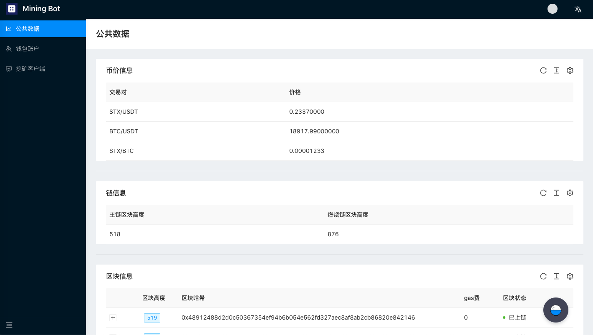
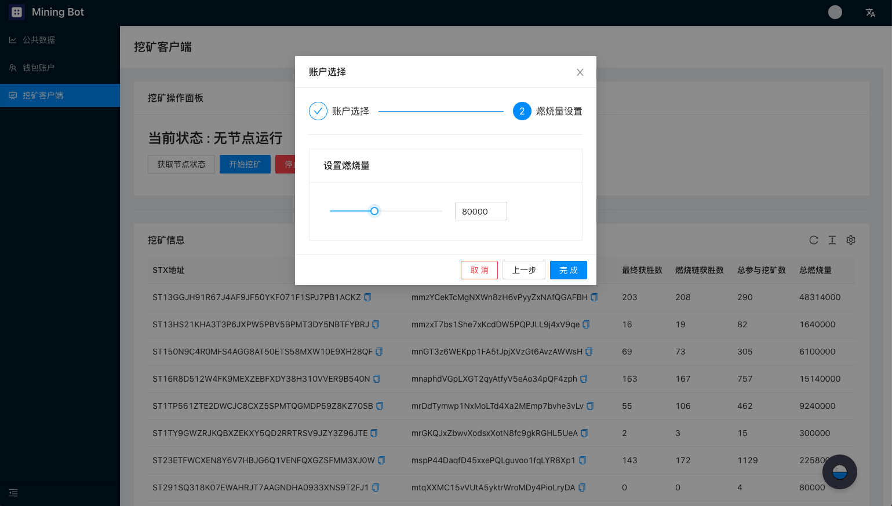
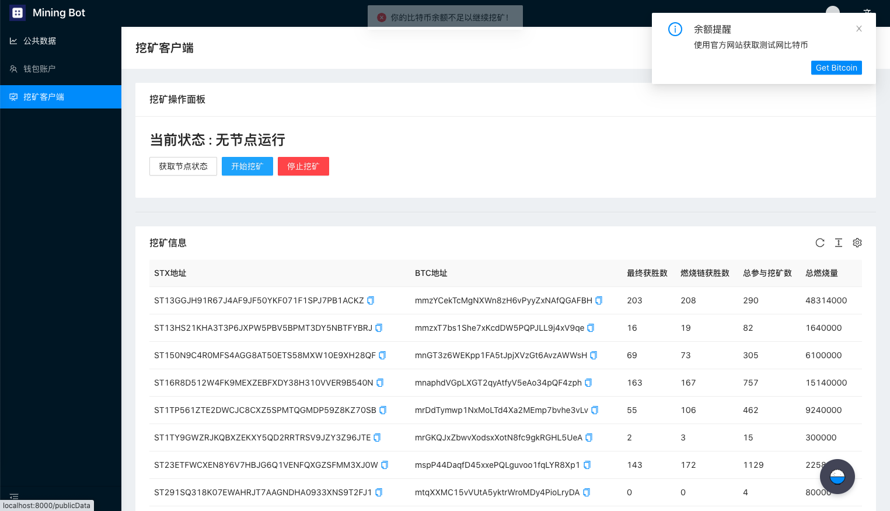
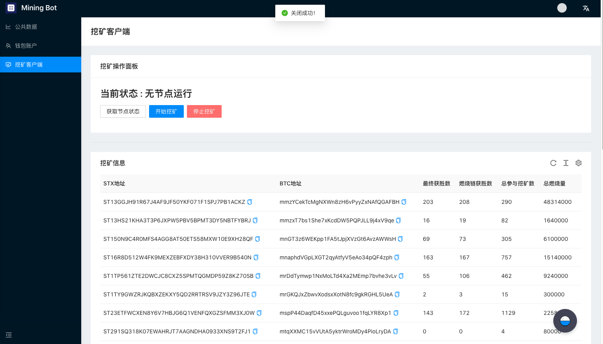

# 挖矿机器人使用说明书

本教程将会介绍如何使用挖矿机器人进行STX挖矿

- [前序环境搭建教程](../Build-Before-Using/Mining-Bot-Alpha-Tutorial-EN.md)

**【提醒】具体的使用说明大家可以参照视频。**
- [Windows 教程](https://www.youtube.com/watch?v=FXifFx0Akzc)
- [MacOS 教程](https://www.youtube.com/watch?v=TCtCTttsSeI)

## 登陆页面介绍

当你在浏览器中输入 **http://localhost:8000/** 的时候，会看到如下界面：


当你第一次登陆的时候，会提示让您输入**锁定密码**，该密码主要用于**登陆认证**、**私钥加密保护**。当输入两次相同的密码后，就会进入挖矿机器人的主页面。进入主页面后可以通过下图中右上角的账户状态栏进行账户锁定。


点击**锁定账户**后会跳转到如下界面，需要重新输入第一次设置的锁定密码进行账户解锁。


:artificial_satellite:**【提醒】该密码无法被恢复**

主页面由三个部分组成：**公开数据页面**、**钱包页面**、与**客户端页面**。接下来将逐个页面讲解如何通过挖矿机器人获取挖矿数据并参与挖矿。

## 公开数据页面

如下图所示，公开数据页面旨在为挖矿机器人策略提供丰富的数据来源，公开数据页面如上图所示。现阶段包含如下信息：
- 币价信息：STX、BTC交易对信息
- Stacks链高度信息
- Stacks链区块信息




## 钱包页面

### 比特币与Stacks地址在线生成

:artificial_satellite:**【提醒】如果你有24助记词的BTC或STX地址，可以选择跳过本节**

本小节参考[官方挖矿文档](https://docs.blockstack.org/mining)中对于生成在线地址的指令。

运行如下指令：

``` 
npx @stacks/cli make_keychain -t
```

运行上述指令后会看到很多安装日志，在最后你可以看到一个JSON，类似于：

```
{
  "mnemonic": "exhaust spin topic distance hole december impulse gate century absent breeze ostrich armed clerk oak peace want scrap auction sniff cradle siren blur blur",
  "keyInfo": {
    "privateKey": "2033269b55026ff2eddaf06d2e56938f7fd8e9d697af8fe0f857bb5962894d5801",
    "address": "STTX57EGWW058FZ6WG3WS2YRBQ8HDFGBKEFBNXTF",
    "btcAddress": "mkRYR7KkPB1wjxNjVz3HByqAvVz8c4B6ND",
    "index": 0
  }
}
```
:artificial_satellite:**【提醒】上述信息请务必保存，为比特币、Stacks私钥等核心信息**


### 比特币与Stacks地址导入
点击钱包账户页面中的**添加账户**一栏，会弹出导入地址的对话框，将24个助记词按照拷贝粘贴至对话框中（助记词之间用空格隔开），并选择相应类型，便可完成地址导入。

在钱包账户页面中点击**添加账户**：


将24个助记词按照拷贝粘贴至对话框中（助记词之间用空格隔开），并选择账户类型，点击提交：


可以在列表中看到新增的地址，以及其对应的类型与账户余额。


## 客户端页面

**【提醒】此部分版本更新较大，具体的使用说明大家可以参照视频。文档后续将进行同步更新**
- [推荐教程](https://www.youtube.com/watch?v=TCtCTttsSeI)

进入客户端界面的时候，会看到**挖矿操作面板**与**挖矿信息**两个面板。如果你是第一次进入客户端，你会看到当前状态显示为**无节点运行**


### 开始挖矿

点击**挖矿操作面板**的**开始挖矿**，弹出如下图所示的账户选择对话框。此处账户列表为钱包页面中导入的BTC地址列表，如果你没有在钱包页面导入过地址，无法继续挖矿。


选择账户后，请设置燃烧量，燃烧单位为比特币最小单位，聪（Satoshi）。选择合适的燃烧量并点击完成。



如果账户余额充足，会显示挖矿程序正在运行：


如果账户余额不充足，会显示余额提醒，需要去充值比特币：



### 停止挖矿

当前状态显示有进程正在运行时可以点击**停止挖矿**，当状态刷新至无节点运行时，表示节点停止成功：



### 矿工信息

下图显示了矿工地址对应的出块数量、参与挖矿数量、以及总共燃烧比特币的数量统计。该信息对于设置燃烧量有一定参考价值。

