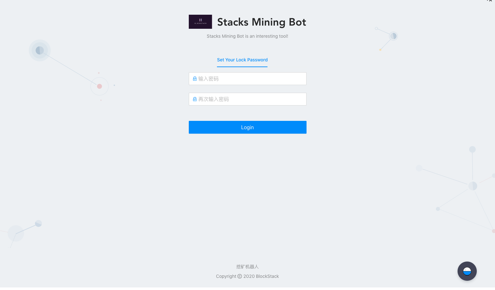
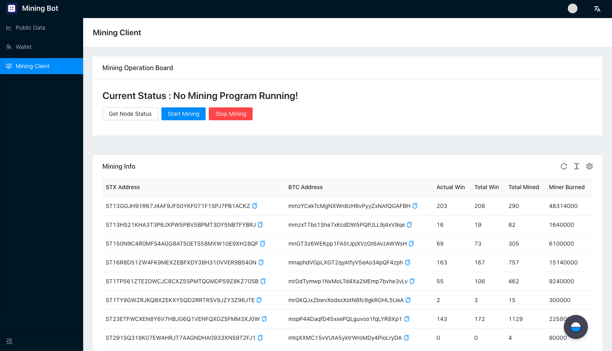

# User's Guide of Mining-Bot

This documentation will introduce to you how to mine STX using Mining-Bot

- [Pre-order tutorial](../Build-Before-Using/Mining-Bot-Alpha-Tutorial-EN.md)

**【Tips】 Tutorial videos released, please refer to the video for specific instructions.**
- [Windows tutorial](https://www.youtube.com/watch?v=FXifFx0Akzc)
- [MacOS tutorial](https://www.youtube.com/watch?v=TCtCTttsSeI)

## Login Page Introduction

When you input **http://localhost:8000/** in your browser, you will see the following interface:




When you log in for the first time, you will be prompted to enter the **lock password**, which is mainly used for **login authentication** and **private key encryption protection**. After entering the same password twice, you will enter the main page of the Mining-Bot. After entering the main page, you can lock the account through the account status bar in the upper right corner of the figure below.


After clicking **Lock Your Account**, it will jump to the following interface. You need to re-enter the lock password for the first time setting to unlock the account.


:artificial_satellite:**【Notification】lock password cannot be recovered**

The main page consists of three parts: **Public Data Page**, **Wallet Page**, and **Client Page**. Next, we will explain how to obtain mining data and participate in mining through Mining-Bot.


## Public Data Page

As shown in the figure below, the public data page is designed to provide rich data sources for mining robot strategies, and the public data page is shown in the figure above. At this stage, the following information is included:

- Currency price information: STX, BTC trading pair information
- Stacks chain height information
- Stacks chain block information


## Wallet Page

### Bitcoin and Stacks address online generation

:artificial_satellite:**【Notification】If you have a BTC or STX address with 24 mnemonics, you can choose to skip this section.**


This section refers to the instructions for generating online addresses in the [official mining documentation](https://docs.blockstack.org/mining).


Run the following command:

``` 
npx @stacks/cli make_keychain -t
```

After running the above command, you will see a lot of installation logs. At the end you can see a JSON, similar to:

```
{
  "mnemonic": "exhaust spin topic distance hole december impulse gate century absent breeze ostrich armed clerk oak peace want scrap auction sniff cradle siren blur blur",
  "keyInfo": {
    "privateKey": "2033269b55026ff2eddaf06d2e56938f7fd8e9d697af8fe0f857bb5962894d5801",
    "address": "STTX57EGWW058FZ6WG3WS2YRBQ8HDFGBKEFBNXTF",
    "btcAddress": "mkRYR7KkPB1wjxNjVz3HByqAvVz8c4B6ND",
    "index": 0
  }
}
```
:artificial_satellite:**【Notification】Information above must be saved carefully such as Bitcoin and Stacks private key**


### Bitcoin and Stacks address import

Click the **Add** button on the wallet account page, and a dialog box for importing addresses will pop up. Copy and paste 24 mnemonic words into the dialog box (separated by spaces), and select The corresponding type can complete the address import.

Click **Add** on the wallet account page:


Copy and paste the 24 mnemonic words into the dialog box (separated by spaces), select the account type, and click submit:


You can see the newly added address in the list, as well as its corresponding type and account balance.


## Client Page

**【Tips】This part differs a lot by version update, you can follow the video to learn. Documentation will be updated later**
- [Recommended Video](https://www.youtube.com/watch?v=TCtCTttsSeI)

When you enter the client interface, you will see two panels **Mining Operation Board** and **Mining Info**. If you enter the client for the first time, you will see the current status is displayed as **No Mining Program Running**



### Start Mining

Click **Start Mining** in **Mining Operation Board**, and the account selection dialog box shown in the figure below will pop up. The account list here is the list of BTC addresses imported on the wallet page. If you have not imported the addresses on the wallet page, you cannot continue mining.


After selecting the account, please set the burning amount. The burning unit is the smallest unit of Bitcoin, Satoshi. Select the appropriate amount to burn in Mining-Program and click **Finish**.


If the account balance is sufficient, it will show that the mining program is running:


If the account balance is not sufficient, a balance reminder will be displayed and you need to recharge bitcoin:


### Stop Mining

When the current status shows that a process is running, you can click **Stop Mining**. When the status is refreshed to no node running, it means that the node has stopped successfully:


### Miner Info

The figure below shows the number of blocks corresponding to the miner's address, the number of mining participation, and the total number of bitcoins burned. This information has certain reference value for setting the amount of combustion.


