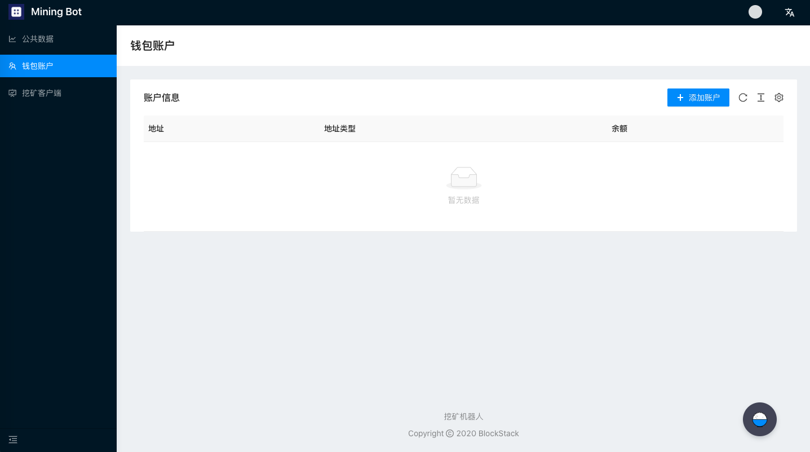

# 挖矿机器人使用说明书

本教程将会介绍如何使用挖矿机器人进行STX挖矿
- [前序环境搭建教程](../Build-Before-Using/Mining-Bot-Alpha-Tutorial-EN.md)

## 登陆页面介绍

当你在浏览器中输入 http://localhost:8000/ 的时候，会看到如下界面：


当你第一次登陆的时候，会提示让您输入**锁定密码**，该密码主要用于**登陆认证**、**私钥加密保护**。当输入两次相同的密码后，就会进入挖矿机器人的主页面。进入主页面后可以通过下图中右上角的账户状态栏进行账户锁定。


点击**锁定账户**后会跳转到如下界面，需要重新输入第一次设置的锁定密码进行账户解锁。


:artificial_satellite:**【提醒】该密码无法被恢复**

主页面由三个部分组成：**公开数据页面**、**钱包页面**、与**客户端页面**。接下来将逐个页面讲解如何通过挖矿机器人获取挖矿数据并参与挖矿。

## 公开数据页面

如下图所示，公开数据页面旨在为挖矿机器人策略提供丰富的数据来源，公开数据页面如上图所示。现阶段包含如下信息：
- 币价信息：STX、BTC交易对信息
- Stacks链高度信息
- Stacks链区块信息


## 钱包页面

### 比特币与Stacks地址在线生成

如果你有24助记词的BTC或STX地址，可以选择跳过本节。
本小节参考[官方挖矿文档](https://docs.blockstack.org/mining)中对于生成在线地址的指令。

运行如下指令：

``` 
npx @stacks/cli make_keychain -t
```

运行上述指令后会看到很多安装日志，在最后你可以看到一个JSON，类似于：

```
{
  "mnemonic": "exhaust spin topic distance hole december impulse gate century absent breeze ostrich armed clerk oak peace want scrap auction sniff cradle siren blur blur",
  "keyInfo": {
    "privateKey": "2033269b55026ff2eddaf06d2e56938f7fd8e9d697af8fe0f857bb5962894d5801",
    "address": "STTX57EGWW058FZ6WG3WS2YRBQ8HDFGBKEFBNXTF",
    "btcAddress": "mkRYR7KkPB1wjxNjVz3HByqAvVz8c4B6ND",
    "index": 0
  }
}
```
:artificial_satellite:**【提醒】上述信息请务必保存，为比特币、Stacks私钥等核心信息**


### 比特币与Stacks地址导入


点击钱包账户页面中的**添加账户**一栏，会弹出导入地址的对话框，将24个助记词按照拷贝粘贴至对话框中（助记词之间用空格隔开），并选择相应类型，便可完成地址导入。


## 客户端页面
