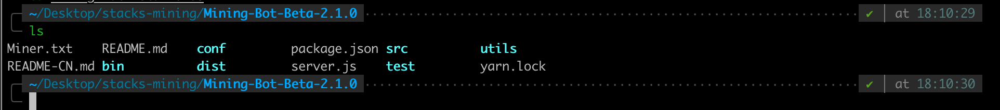

# 挖矿机器人软件安装

本文的目标：演示如何运行Mining Bot Beta版本。

**【提醒】如果想获取更全面的信息，请查看我们的视频教程。**
- [Stacks挖矿机器人客户端2.1.0-Mainnet版](https://www.bilibili.com/video/BV1zb4y1R7F9/)

- [Stacks挖矿机器人客户端2.1.0-Xenon版](https://www.bilibili.com/video/BV1hv411Y7pr/)


## 环境要求：

**MacOS系统确保已经安装**：

- `Node.js >= 14`
- `yarn`包管理工具

`wget`和`unzip`命令可以不安装，通过浏览器即可下载安装包和解压安装包。

**Linux/Windows WSL确保已经安装**：

- `Node.js >= 14`
- `yarn`包管理工具
- `wget`工具
- `unzip`工具

说明：在本教程中，`wget`和`unzip`命令主要是为了获取放在Github Release界面的安装包，如果可以通过界面访问Github Release界面下载安装包并解压，则无需使用`wget`和`unzip`命令。这两个命令主要是针对服务器端用户，或者想通过命令行来下载安装包并解压的用户。

## 环境安装与配置

### MacOS上

#### 1.Node.js的安装

我们推荐你使用`nvm`来控制Nodejs的版本并进行nodejs的安装。本教程来自[nvm官方文档](https://github.com/nvm-sh/nvm)，如果想获取更详细的信息请查阅链接中的文档。

为了安装或更新`nvm`，你需要运行[安装脚本](https://github.com/nvm-sh/nvm/blob/v0.37.0/install.sh)。你需要下载或者直接手动运行脚本，或者可以通过以下两种命令的任意一种来进行安装：

```shell
curl -o- https://raw.githubusercontent.com/nvm-sh/nvm/v0.37.0/install.sh | bash
```

或

```shell
wget -qO- https://raw.githubusercontent.com/nvm-sh/nvm/v0.37.0/install.sh | bash
```

然后你可以使用以下命令来检验是否`nvm`安装成功：

```shell
nvm
```

如果安装成功，输出内容会跟下面类似：

```shell
Node Version Manager

Note: <version> refers to any version-like string nvm understands. This includes:
  - full or partial version numbers, starting with an optional "v" (0.10, v0.1.2, v1)
  - default (built-in) aliases: node, stable, unstable, iojs, system
  - custom aliases you define with `nvm alias foo`

 Any options that produce colorized output should respect the `--no-colors` option.

Usage:
  nvm --help                                Show this message
  nvm --version                             Print out the installed version of nvm
  nvm install [-s] <version>                Download and install a <version>, [-s] from source. Uses .nvmrc if available
    --reinstall-packages-from=<version>     When installing, reinstall packages installed in <node|iojs|node version number>
    --lts                                   When installing, only select from LTS (long-term support) versions
    --lts=<LTS name>                        When installing, only select from versions for a specific LTS line
    --skip-default-packages                 When installing, skip the default-packages file if it exists
    --latest-npm                            After installing, attempt to upgrade to the latest working npm on the given node version
    --no-progress                           Disable the progress bar on any downloads
  nvm uninstall <version>                   Uninstall a version
  nvm uninstall --lts                       Uninstall using automatic LTS (long-term support) alias `lts/*`, if available.
  nvm uninstall --lts=<LTS name>            Uninstall using automatic alias for provided LTS line, if available.
  nvm use [--silent] <version>              Modify PATH to use <version>. Uses .nvmrc if available
    --lts                                   Uses automatic LTS (long-term support) alias `lts/*`, if available.
    --lts=<LTS name>                        Uses automatic alias for provided LTS line, if available.
  nvm exec [--silent] <version> [<command>] Run <command> on <version>. Uses .nvmrc if available
    --lts                                   Uses automatic LTS (long-term support) alias `lts/*`, if available.
    --lts=<LTS name>                        Uses automatic alias for provided LTS line, if available.
  nvm run [--silent] <version> [<args>]     Run `node` on <version> with <args> as arguments. Uses .nvmrc if available
    --lts                                   Uses automatic LTS (long-term support) alias `lts/*`, if available.
    --lts=<LTS name>                        Uses automatic alias for provided LTS line, if available.
  nvm current                               Display currently activated version of Node
  nvm ls                                    List installed versions
  nvm ls <version>                          List versions matching a given <version>
  nvm ls-remote                             List remote versions available for install
    --lts                                   When listing, only show LTS (long-term support) versions
  nvm ls-remote <version>                   List remote versions available for install, matching a given <version>
    --lts                                   When listing, only show LTS (long-term support) versions
    --lts=<LTS name>                        When listing, only show versions for a specific LTS line
  nvm version <version>                     Resolve the given description to a single local version
  nvm version-remote <version>              Resolve the given description to a single remote version
    --lts                                   When listing, only select from LTS (long-term support) versions
    --lts=<LTS name>                        When listing, only select from versions for a specific LTS line
  nvm deactivate                            Undo effects of `nvm` on current shell
  nvm alias [<pattern>]                     Show all aliases beginning with <pattern>
  nvm alias <name> <version>                Set an alias named <name> pointing to <version>
  nvm unalias <name>                        Deletes the alias named <name>
  nvm install-latest-npm                    Attempt to upgrade to the latest working `npm` on the current node version
  nvm reinstall-packages <version>          Reinstall global `npm` packages contained in <version> to current version
  nvm unload                                Unload `nvm` from shell
  nvm which [current | <version>]           Display path to installed node version. Uses .nvmrc if available
  nvm cache dir                             Display path to the cache directory for nvm
  nvm cache clear                           Empty cache directory for nvm

Example:
  nvm install 8.0.0                     Install a specific version number
  nvm use 8.0                           Use the latest available 8.0.x release
  nvm run 6.10.3 app.js                 Run app.js using node 6.10.3
  nvm exec 4.8.3 node app.js            Run `node app.js` with the PATH pointing to node 4.8.3
  nvm alias default 8.1.0               Set default node version on a shell
  nvm alias default node                Always default to the latest available node version on a shell

Note:
  to remove, delete, or uninstall nvm - just remove the `$NVM_DIR` folder (usually `~/.nvm`)
```

然后你可以使用以下命令来安装Nodejs：

```shell
nvm install 14.15.0
```

然后使用以下命令检查`node`和`npm`是否安装成功：

```shell
# node命令
node -v
# node版本输出
v14.15.0
# npm命令
npm -v
# npm版本输出
6.14.8
```


#### 2.yarn的安装


我们使用`npm`来安装`yarn`：

```shell
npm install -g yarn
```

来检验`yarn`是否安装成功：

```shell
# 使用如下命令
yarn -v
# 版本输出
1.22.4
```


### Linux/Windows WSL

#### 1.Node.js安装
我们推荐你使用`nvm`来控制Nodejs的版本并进行nodejs的安装。本教程来自[nvm官方文档](https://github.com/nvm-sh/nvm)，如果想获取更详细的信息请查阅链接中的文档。

为了安装或更新`nvm`，你需要运行[安装脚本](https://github.com/nvm-sh/nvm/blob/v0.37.0/install.sh)。你需要下载或者直接手动运行脚本，或者可以通过以下两种命令的任意一种来进行安装：

```shell
curl -o- https://raw.githubusercontent.com/nvm-sh/nvm/v0.37.0/install.sh | bash
```

或

```shell
wget -qO- https://raw.githubusercontent.com/nvm-sh/nvm/v0.37.0/install.sh | bash
```

然后你可以使用以下命令来检验是否`nvm`安装成功：

```shell
nvm
```

如果安装成功，输出内容会跟下面类似：

```shell
Node Version Manager

Note: <version> refers to any version-like string nvm understands. This includes:
  - full or partial version numbers, starting with an optional "v" (0.10, v0.1.2, v1)
  - default (built-in) aliases: node, stable, unstable, iojs, system
  - custom aliases you define with `nvm alias foo`

 Any options that produce colorized output should respect the `--no-colors` option.

Usage:
  nvm --help                                Show this message
  nvm --version                             Print out the installed version of nvm
  nvm install [-s] <version>                Download and install a <version>, [-s] from source. Uses .nvmrc if available
    --reinstall-packages-from=<version>     When installing, reinstall packages installed in <node|iojs|node version number>
    --lts                                   When installing, only select from LTS (long-term support) versions
    --lts=<LTS name>                        When installing, only select from versions for a specific LTS line
    --skip-default-packages                 When installing, skip the default-packages file if it exists
    --latest-npm                            After installing, attempt to upgrade to the latest working npm on the given node version
    --no-progress                           Disable the progress bar on any downloads
  nvm uninstall <version>                   Uninstall a version
  nvm uninstall --lts                       Uninstall using automatic LTS (long-term support) alias `lts/*`, if available.
  nvm uninstall --lts=<LTS name>            Uninstall using automatic alias for provided LTS line, if available.
  nvm use [--silent] <version>              Modify PATH to use <version>. Uses .nvmrc if available
    --lts                                   Uses automatic LTS (long-term support) alias `lts/*`, if available.
    --lts=<LTS name>                        Uses automatic alias for provided LTS line, if available.
  nvm exec [--silent] <version> [<command>] Run <command> on <version>. Uses .nvmrc if available
    --lts                                   Uses automatic LTS (long-term support) alias `lts/*`, if available.
    --lts=<LTS name>                        Uses automatic alias for provided LTS line, if available.
  nvm run [--silent] <version> [<args>]     Run `node` on <version> with <args> as arguments. Uses .nvmrc if available
    --lts                                   Uses automatic LTS (long-term support) alias `lts/*`, if available.
    --lts=<LTS name>                        Uses automatic alias for provided LTS line, if available.
  nvm current                               Display currently activated version of Node
  nvm ls                                    List installed versions
  nvm ls <version>                          List versions matching a given <version>
  nvm ls-remote                             List remote versions available for install
    --lts                                   When listing, only show LTS (long-term support) versions
  nvm ls-remote <version>                   List remote versions available for install, matching a given <version>
    --lts                                   When listing, only show LTS (long-term support) versions
    --lts=<LTS name>                        When listing, only show versions for a specific LTS line
  nvm version <version>                     Resolve the given description to a single local version
  nvm version-remote <version>              Resolve the given description to a single remote version
    --lts                                   When listing, only select from LTS (long-term support) versions
    --lts=<LTS name>                        When listing, only select from versions for a specific LTS line
  nvm deactivate                            Undo effects of `nvm` on current shell
  nvm alias [<pattern>]                     Show all aliases beginning with <pattern>
  nvm alias <name> <version>                Set an alias named <name> pointing to <version>
  nvm unalias <name>                        Deletes the alias named <name>
  nvm install-latest-npm                    Attempt to upgrade to the latest working `npm` on the current node version
  nvm reinstall-packages <version>          Reinstall global `npm` packages contained in <version> to current version
  nvm unload                                Unload `nvm` from shell
  nvm which [current | <version>]           Display path to installed node version. Uses .nvmrc if available
  nvm cache dir                             Display path to the cache directory for nvm
  nvm cache clear                           Empty cache directory for nvm

Example:
  nvm install 8.0.0                     Install a specific version number
  nvm use 8.0                           Use the latest available 8.0.x release
  nvm run 6.10.3 app.js                 Run app.js using node 6.10.3
  nvm exec 4.8.3 node app.js            Run `node app.js` with the PATH pointing to node 4.8.3
  nvm alias default 8.1.0               Set default node version on a shell
  nvm alias default node                Always default to the latest available node version on a shell

Note:
  to remove, delete, or uninstall nvm - just remove the `$NVM_DIR` folder (usually `~/.nvm`)
```

然后你可以使用以下命令来安装Nodejs：

```shell
nvm install 14.15.0
```

然后使用以下命令检查`node`和`npm`是否安装成功：

```shell
# node命令
node -v
# node版本输出
v14.15.0
# npm命令
npm -v
# npm版本输出
6.14.8
```

#### 2.yarn安装
我们使用`npm`来安装`yarn`：

```shell
npm install -g yarn
```

来检验`yarn`是否安装成功：

```shell
# 使用如下命令
yarn -v
# 版本输出
1.22.4
```

#### 3.wget的安装
**Ubuntu/Debian上安装**，执行：

```bash
apt-get install wget
```

**RHEL，CentOS，Fedora上安装**，执行：

```bash
yum install wget
```

确保安装，检查版本：

```bash
wget --verison
```

#### 4.unzip的安装

**Ubuntu/Debian上安装**，执行：

```bash
sudo apt install unzip
```

**RHEL，CentOS，Fedora上安装**，执行：

```bash
sudo yum install unzip
```

## Mining-Bot Beta版本安装并运行

### 步骤一：下载安装包

#### 方式一：图形界面下载

在桌面（任意你喜好的位置均可）新建一个文件夹，命名为`stacks-mining`.

访问链接 ：[Mining-Bot Releases](https://github.com/Daemon-Technologies/Mining-Bot/releases/tag/2.1.0)

进入到Mining-Bot Beta 2.1.0 Release界面：


**直接点击对应的版本，直接浏览器下载**，选择存储到当前工作目录：`stacks-mining`。


#### 方式二：命令行下载

打开命令行窗口，Win10用户打开新的WSL窗口。

新建一个空目录：

```bash
mkdir stacks-mining
```

目录名可以随便取，这里演示目的，取名为`stacks-mining`。

进入此空目录：

```bash
cd stacks-mining
```

访问链接 ：[Mining-Bot Releases](https://github.com/Daemon-Technologies/Mining-Bot/releases/tag/2.1.0)

进入到Mining-Bot Beta 2.1.0 Release界面：


**选择自己的系统版本进行链接复制与下载**。在本教程中，本地环境为MacOS，选择[Mining-Bot_V2.1.0_mac.zip](https://github.com/Daemon-Technologies/Mining-Bot/releases/download/2.1.0/Mining-Bot_V2.1.0_mac.zip)，右键复制链接地址：


使用`wget`命令下载对应系统的`zip`文件：

```bash
wget https://github.com/Daemon-Technologies/Mining-Bot/releases/download/2.1.0/Mining-Bot_V2.1.0_mac.zip
```


### 步骤二：解压zip文件

#### 方式一：图形界面解压

MacOS上双击即可解压文件到当前目录：


#### 方式二：命令行解压

通过`unzip -d`命令：

```bash
unzip Mining-Bot_V2.1.0_mac.zip -d Mining-Bot-Beta-2.1.0/
```

其中，`-d`表示解压到的目录名称，不存在则新建目录，并将压缩文件内容输出到该文件目录，这里我们输出到当前目录下的`Mining-Bot-Beta`文件夹（会新建此目录）。


### 步骤三：开启程序

进入解压的文件夹：`Mining-Bot-Beta-2.1.0`。

执行命令：`cd Mining-Bot-Beta-2.1.0`

查看文件：`ls`



运行`yarn install`命令或者`npm install`命令，或者直接输入`yarn`命令，安装依赖包，并确保`Nodejs`版本大于14。

安装完成后，出现`node_modules`文件夹。


#### 1.启动Mining-Bot

执行命令：`yarn start node1234`

其中，`node1234`是设置的**认证密码**，在`yarn start`后面配置。

启动成功显示信息如下：


注意：如果使用的是服务器，需要根据自己服务器的`ip地址`来访问`Mining-Bot`。

本机测试时未显示`ip地址`，在Win10上会显示，查询本机`ip地址`可以通过`ifconfig`指令获取。

注意到启动程序后，有两个进程分别在运行，`5000`端口是后台服务进程，`8000`端口是挖矿机器人的客户端进程。

#### 2.访问Mining-Bot

为了访问挖矿机器人，我们只需要复制Mining-Bot Client地址。

浏览器中输入：`http://localhost:8000/`，或者`http://your-ip:8000`，即可访问，如：`http://192.168.31.171:8000/`


当你第一次登陆的时候，会提示让您输入**锁定密码**，该密码主要用于**登陆认证**、**私钥加密保护**，这里的锁定密码和之前的`yarn start node1234`认证密码没有关系，**没有必要保持一致**。

至此，程序安装成功，后面步骤将会在浏览器页面操作，请参考[用户手册](../Use-Mining-Bot-For-Mining/User-Guide-of-Mining-Bot-Beta-CN.md).

