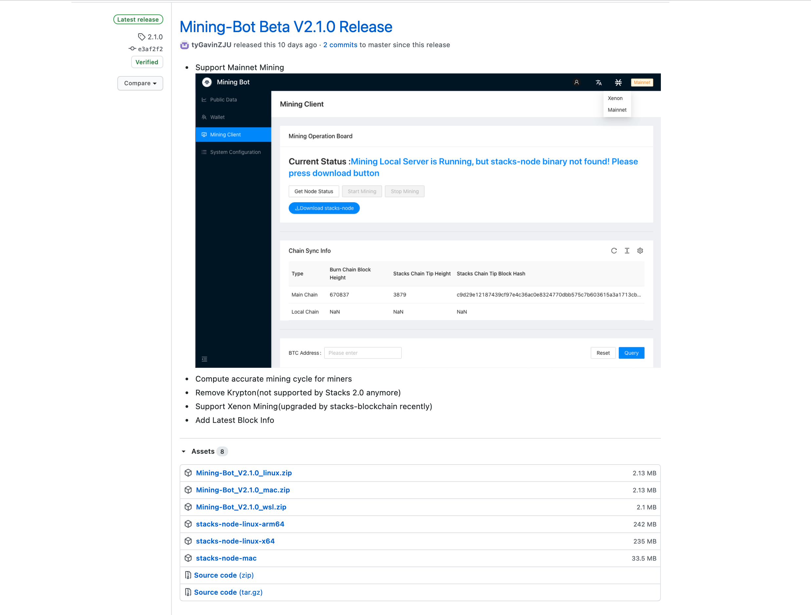
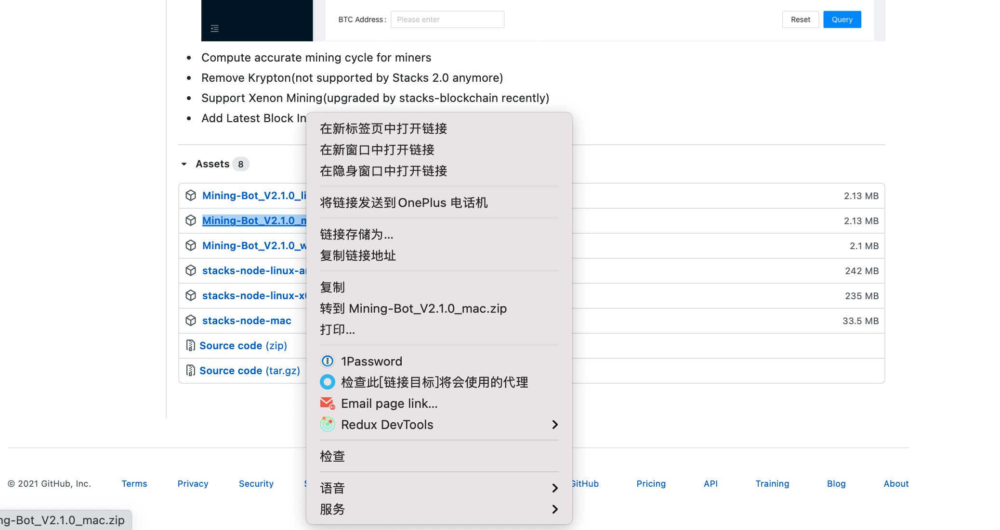
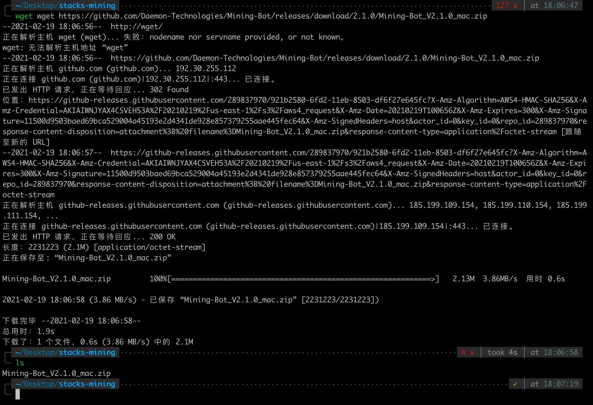
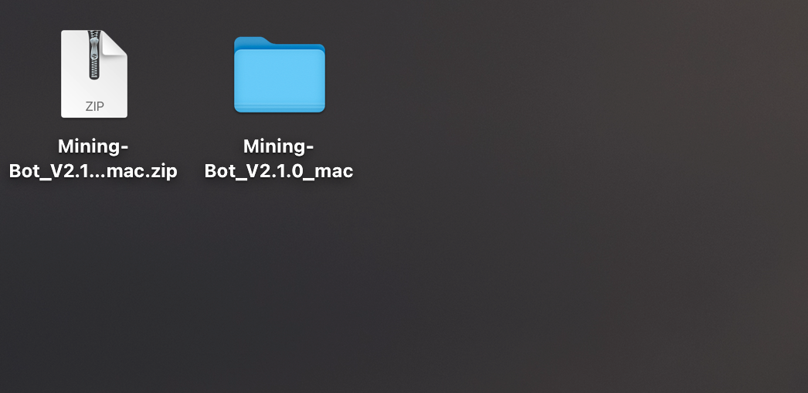
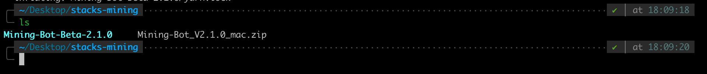
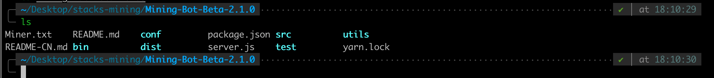
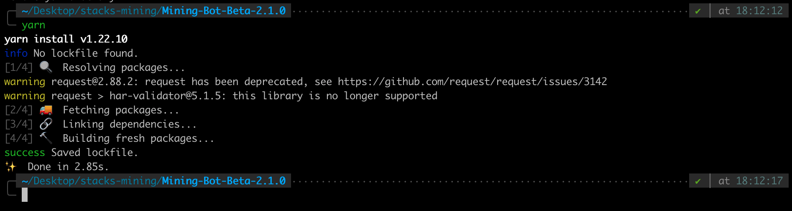
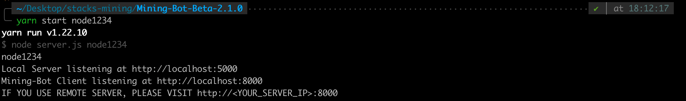

# Building Mining-Bot Before Use

The goal of this article: Demonstrate how to run Mining Bot Beta version.

**【Tips】 If you want to get more comprehensive information, please see our tutorial video.**
- [Stacks Mining Bot Client version 2.1.0-Xenon Testnet](https://www.youtube.com/watch?v=_bWLbvDjj9g)
- [Stacks Mining Bot Client version 2.1.0-Mainnet](https://www.youtube.com/watch?v=8uk21KldZYI)

## Requirements:

**For MacOS users**, make sure you have installed:

- `Nodej >= 14`
- `yarn` package management tool

`wget` and `unzip` command tools may not required for MacOS users due to the Mining Bot zip file could be directly **downloaded** and **unzipped** via browser.

**For Linux/Windows WSL users**, make sure you have installed:

Make sure you have installed:

- `Nodej >= 14`
- `yarn` package management tool
- `wget` command tool
- `unzip` command tool

**Note**: In this tutorial, `wget` and `unzip` commands are mainly for downloading and extracting the zipped files hosting on Github Release Page. If you can access this page via browser to download and extract, there is no need to use `wget` and `unzip` at all. Command tools are useful when you are working on server side, or you are the one who wants to try command line locally to download and extract this zipped file.

### Environmental installation and configuration

### MacOS

#### 1.Install Node.js

We recommend that you use `nvm` to control the version of Nodejs and install node. The tutorial of installing `nvm` comes from [official document](https://github.com/nvm-sh/nvm). You can see it for more information.

To **install** or **update** `nvm`, you should run the [install script](https://github.com/nvm-sh/nvm/blob/v0.37.0/install.sh). To do that, you may either download and run the script manually, or use the following cURL or Wget command:

```shell
curl -o- https://raw.githubusercontent.com/nvm-sh/nvm/v0.37.0/install.sh | bash
```

```shell
wget -qO- https://raw.githubusercontent.com/nvm-sh/nvm/v0.37.0/install.sh | bash
```

Run the following command to make the `nvm` command available:

```shell
export NVM_DIR="$HOME/.nvm"
[ -s "$NVM_DIR/nvm.sh" ] && \. "$NVM_DIR/nvm.sh"  # This loads nvm
[ -s "$NVM_DIR/bash_completion" ] && \. "$NVM_DIR/bash_completion"  # This loads nvm bash_completion
```

Then you should use the following command to see if you have installed `nvm`:

```shell
nvm
```

If the installation is successful, the output similar to the following will be displayed:

```shell
Node Version Manager

Note: <version> refers to any version-like string nvm understands. This includes:
  - full or partial version numbers, starting with an optional "v" (0.10, v0.1.2, v1)
  - default (built-in) aliases: node, stable, unstable, iojs, system
  - custom aliases you define with `nvm alias foo`

 Any options that produce colorized output should respect the `--no-colors` option.

Usage:
  nvm --help                                Show this message
  nvm --version                             Print out the installed version of nvm
  nvm install [-s] <version>                Download and install a <version>, [-s] from source. Uses .nvmrc if available
    --reinstall-packages-from=<version>     When installing, reinstall packages installed in <node|iojs|node version number>
    --lts                                   When installing, only select from LTS (long-term support) versions
    --lts=<LTS name>                        When installing, only select from versions for a specific LTS line
    --skip-default-packages                 When installing, skip the default-packages file if it exists
    --latest-npm                            After installing, attempt to upgrade to the latest working npm on the given node version
    --no-progress                           Disable the progress bar on any downloads
  nvm uninstall <version>                   Uninstall a version
  nvm uninstall --lts                       Uninstall using automatic LTS (long-term support) alias `lts/*`, if available.
  nvm uninstall --lts=<LTS name>            Uninstall using automatic alias for provided LTS line, if available.
  nvm use [--silent] <version>              Modify PATH to use <version>. Uses .nvmrc if available
    --lts                                   Uses automatic LTS (long-term support) alias `lts/*`, if available.
    --lts=<LTS name>                        Uses automatic alias for provided LTS line, if available.
  nvm exec [--silent] <version> [<command>] Run <command> on <version>. Uses .nvmrc if available
    --lts                                   Uses automatic LTS (long-term support) alias `lts/*`, if available.
    --lts=<LTS name>                        Uses automatic alias for provided LTS line, if available.
  nvm run [--silent] <version> [<args>]     Run `node` on <version> with <args> as arguments. Uses .nvmrc if available
    --lts                                   Uses automatic LTS (long-term support) alias `lts/*`, if available.
    --lts=<LTS name>                        Uses automatic alias for provided LTS line, if available.
  nvm current                               Display currently activated version of Node
  nvm ls                                    List installed versions
  nvm ls <version>                          List versions matching a given <version>
  nvm ls-remote                             List remote versions available for install
    --lts                                   When listing, only show LTS (long-term support) versions
  nvm ls-remote <version>                   List remote versions available for install, matching a given <version>
    --lts                                   When listing, only show LTS (long-term support) versions
    --lts=<LTS name>                        When listing, only show versions for a specific LTS line
  nvm version <version>                     Resolve the given description to a single local version
  nvm version-remote <version>              Resolve the given description to a single remote version
    --lts                                   When listing, only select from LTS (long-term support) versions
    --lts=<LTS name>                        When listing, only select from versions for a specific LTS line
  nvm deactivate                            Undo effects of `nvm` on current shell
  nvm alias [<pattern>]                     Show all aliases beginning with <pattern>
  nvm alias <name> <version>                Set an alias named <name> pointing to <version>
  nvm unalias <name>                        Deletes the alias named <name>
  nvm install-latest-npm                    Attempt to upgrade to the latest working `npm` on the current node version
  nvm reinstall-packages <version>          Reinstall global `npm` packages contained in <version> to current version
  nvm unload                                Unload `nvm` from shell
  nvm which [current | <version>]           Display path to installed node version. Uses .nvmrc if available
  nvm cache dir                             Display path to the cache directory for nvm
  nvm cache clear                           Empty cache directory for nvm

Example:
  nvm install 8.0.0                     Install a specific version number
  nvm use 8.0                           Use the latest available 8.0.x release
  nvm run 6.10.3 app.js                 Run app.js using node 6.10.3
  nvm exec 4.8.3 node app.js            Run `node app.js` with the PATH pointing to node 4.8.3
  nvm alias default 8.1.0               Set default node version on a shell
  nvm alias default node                Always default to the latest available node version on a shell

Note:
  to remove, delete, or uninstall nvm - just remove the `$NVM_DIR` folder (usually `~/.nvm`)
```

Then you can use the following command to install Nodejs:

```shell
nvm install 14.15.0
```

Then use the following commands to see if node and npm are installed correctly:

```shell
# use these two commands
node -v
# here is the version output
v14.15.0
npm -v
# here is the version output
6.14.8
```

#### 2.Install yarn

Use `npm` to install `yarn`:

```shell
npm install -g yarn
```

To check if `yarn` is installed correctly:

```shell
# use the command
yarn -v
# here is the version output
1.22.4
```

### Linux/Windows WSL

#### 1.Install Node.js

We recommend that you use `nvm` to control the version of Nodejs and install node. The tutorial of installing `nvm` comes from [official document](https://github.com/nvm-sh/nvm). You can see it for more information.

To **install** or **update** `nvm`, you should run the [install script](https://github.com/nvm-sh/nvm/blob/v0.37.0/install.sh). To do that, you may either download and run the script manually, or use the following cURL or Wget command:

```shell
curl -o- https://raw.githubusercontent.com/nvm-sh/nvm/v0.37.0/install.sh | bash
```

```shell
wget -qO- https://raw.githubusercontent.com/nvm-sh/nvm/v0.37.0/install.sh | bash
```

Run the following command to make the `nvm` command available:

```shell
export NVM_DIR="$HOME/.nvm"
[ -s "$NVM_DIR/nvm.sh" ] && \. "$NVM_DIR/nvm.sh"  # This loads nvm
[ -s "$NVM_DIR/bash_completion" ] && \. "$NVM_DIR/bash_completion"  # This loads nvm bash_completion
```

Then you should use the following command to see if you have installed `nvm`:

```shell
nvm
```

If the installation is successful, the output similar to the following will be displayed:

```shell
Node Version Manager

Note: <version> refers to any version-like string nvm understands. This includes:
  - full or partial version numbers, starting with an optional "v" (0.10, v0.1.2, v1)
  - default (built-in) aliases: node, stable, unstable, iojs, system
  - custom aliases you define with `nvm alias foo`

 Any options that produce colorized output should respect the `--no-colors` option.

Usage:
  nvm --help                                Show this message
  nvm --version                             Print out the installed version of nvm
  nvm install [-s] <version>                Download and install a <version>, [-s] from source. Uses .nvmrc if available
    --reinstall-packages-from=<version>     When installing, reinstall packages installed in <node|iojs|node version number>
    --lts                                   When installing, only select from LTS (long-term support) versions
    --lts=<LTS name>                        When installing, only select from versions for a specific LTS line
    --skip-default-packages                 When installing, skip the default-packages file if it exists
    --latest-npm                            After installing, attempt to upgrade to the latest working npm on the given node version
    --no-progress                           Disable the progress bar on any downloads
  nvm uninstall <version>                   Uninstall a version
  nvm uninstall --lts                       Uninstall using automatic LTS (long-term support) alias `lts/*`, if available.
  nvm uninstall --lts=<LTS name>            Uninstall using automatic alias for provided LTS line, if available.
  nvm use [--silent] <version>              Modify PATH to use <version>. Uses .nvmrc if available
    --lts                                   Uses automatic LTS (long-term support) alias `lts/*`, if available.
    --lts=<LTS name>                        Uses automatic alias for provided LTS line, if available.
  nvm exec [--silent] <version> [<command>] Run <command> on <version>. Uses .nvmrc if available
    --lts                                   Uses automatic LTS (long-term support) alias `lts/*`, if available.
    --lts=<LTS name>                        Uses automatic alias for provided LTS line, if available.
  nvm run [--silent] <version> [<args>]     Run `node` on <version> with <args> as arguments. Uses .nvmrc if available
    --lts                                   Uses automatic LTS (long-term support) alias `lts/*`, if available.
    --lts=<LTS name>                        Uses automatic alias for provided LTS line, if available.
  nvm current                               Display currently activated version of Node
  nvm ls                                    List installed versions
  nvm ls <version>                          List versions matching a given <version>
  nvm ls-remote                             List remote versions available for install
    --lts                                   When listing, only show LTS (long-term support) versions
  nvm ls-remote <version>                   List remote versions available for install, matching a given <version>
    --lts                                   When listing, only show LTS (long-term support) versions
    --lts=<LTS name>                        When listing, only show versions for a specific LTS line
  nvm version <version>                     Resolve the given description to a single local version
  nvm version-remote <version>              Resolve the given description to a single remote version
    --lts                                   When listing, only select from LTS (long-term support) versions
    --lts=<LTS name>                        When listing, only select from versions for a specific LTS line
  nvm deactivate                            Undo effects of `nvm` on current shell
  nvm alias [<pattern>]                     Show all aliases beginning with <pattern>
  nvm alias <name> <version>                Set an alias named <name> pointing to <version>
  nvm unalias <name>                        Deletes the alias named <name>
  nvm install-latest-npm                    Attempt to upgrade to the latest working `npm` on the current node version
  nvm reinstall-packages <version>          Reinstall global `npm` packages contained in <version> to current version
  nvm unload                                Unload `nvm` from shell
  nvm which [current | <version>]           Display path to installed node version. Uses .nvmrc if available
  nvm cache dir                             Display path to the cache directory for nvm
  nvm cache clear                           Empty cache directory for nvm

Example:
  nvm install 8.0.0                     Install a specific version number
  nvm use 8.0                           Use the latest available 8.0.x release
  nvm run 6.10.3 app.js                 Run app.js using node 6.10.3
  nvm exec 4.8.3 node app.js            Run `node app.js` with the PATH pointing to node 4.8.3
  nvm alias default 8.1.0               Set default node version on a shell
  nvm alias default node                Always default to the latest available node version on a shell

Note:
  to remove, delete, or uninstall nvm - just remove the `$NVM_DIR` folder (usually `~/.nvm`)
```

Then you can use the following command to install Nodejs:

```shell
nvm install 14.15.0
```

Then use the following commands to see if node and npm are installed correctly:

```shell
# use these two commands
node -v
# here is the version output
v14.15.0
npm -v
# here is the version output
6.14.8
```

#### 2.Install yarn

Use `npm` to install `yarn`:

```shell
npm install -g yarn
```

To check if `yarn` is installed correctly:

```shell
# use the command
yarn -v
# here is the version output
1.22.4
```

#### 3.Install wget 

**On Ubuntu/Debian**:

```bash
apt-get install wget
```

**On RHEL，CentOS，Fedora**:

```bash
yum install wget
```

Make sure to install, check the version:

```bash
wget --verison
```

#### 4.Install unzip

**On Ubuntu/Debian**:

```bash
sudo apt install unzip
```

**On RHEL，CentOS，Fedora**:

```bash
sudo yum install unzip
```

## Mining-Bot Beta version installation and running

### Step 1: Download the installation package

#### Way 1: Download via browser

On Desktop(or any other location you like) make a new directory, name it as `stacks-mining`.

Go to: [Mining-Bot Releases](https://github.com/Daemon-Technologies/Mining-Bot/releases/tag/2.1.0)

Now you can see Mining-Bot Beta 2.1.0 Release page：



**Go directly click the version matching your system, click it and download**, select the directory to save, which is the directory you make above: `stacks-mining`.

#### Way 2: Download via command line

Open a command line window, and Win10 users open a new WSL window.

Create an empty directory: 

```bash
mkdir stacks-mining
```

The name of the directory can be taken whatever you want. For the purpose of demonstration here, it is named `stacks-mining`.

Enter this empty directory:

```bash
cd stacks-mining
```

Access link: [Mining-Bot Releases](https://github.com/Daemon-Technologies/Mining-Bot/releases/tag/2.1.0)

Enter the Mining-Bot Beta 2.1.0 Release interface:


Choose your own system version to copy and download the link. In this tutorial, the local environment is MacOS, select [Mining-Bot_V2.1.0_mac.zip](https://github.com/Daemon-Technologies/Mining-Bot/releases/download/2.1.0/Mining-Bot_V2.1.0_mac.zip), right click to copy the link:





Use the `wget` command to download the `zip` file of the corresponding system:

```bash
wget https://github.com/Daemon-Technologies/Mining-Bot/releases/download/2.1.0/Mining-Bot_V2.1.0_mac.zip
```



Or directly click the corresponding version, download it directly from the browser, and choose to store it in the current working directory: `stacks-mining`。

### Step 2: Unzip the zip file

#### Way 1: Unzip it via GUI

On MacOS, double click the `.zip` file and it will be unzipped into the current working directory:




#### Way 2: Unzip it via command line

Here is a demonstration of the way via `unzip -d` command：

```bash
unzip Mining-Bot_V2.1.0_mac.zip -d Mining-Bot-Betamac-unzip-release-2.1.0/
```

Among them, `-d` represents the name of the output directory. If it does not exist, create a new directory and output the compressed file content to the file directory. Here we output to the `Mining-Bot-Beta` folder under the current directory (this directory will be created).




### Step 3: Start the program

Enter the unzipped folder: `Mining-Bot-Beta-2.1.0`。

Excute the command: 

```bash
cd Mining-Bot-Beta-2.1.0
```

Check the file:`ls`



Run`yarn install` command or `npm install`, or directly use `yarn`, install dependent packages and ensure that the Nodejs version is greater than 14.

After the installation is complete, the `node_modules` folder appears.




#### 1. Start Mining-Bot

Execute the command: `yarn start node1234`

And，`node1234` is the authentication password, configure after `yarn start`.

The information displayed when successful startup is as follows:




**Note**: If you are using a server, you need to access Mining-Bot according to the `ip` address of your server.

The ip address is not displayed when my machine is tested, it will be displayed on Win10, and the `ip` address of the machine can be obtained through the `ifconfig` command.

Note that after starting the program, there are two processes running separately, port `5000` is the background service process, and port `8000` is the client process of the mining bot.

#### 2. Access Mining-Bot

In order to access the mining bot, we only need to copy the Mining-Bot Client address.

Type/Paste in the browser: http://localhost:8000/`，or`http://your-ip:8000 ,e.g. http://192.168.31.171:8000/


When you log in for the first time, you will be prompted to enter the **Lock Password.** This password is mainly used for login authentication and private key encryption protection. The lock password here has nothing to do with the previous `yarn start node1234` authentication password, and there is no need to keep the same.

At this point, the program is successfully installed. The next steps will be operated on the browser page. Please refer to the [User Guide](../Use-Mining-Bot-For-Mining/User-Guide-of-Mining-Bot-Beta-EN.md).

