# User Guide of Mining-Bot: Beta Version

This tutorial will introduce how to use mining bot for STX mining.

- [Previous Environment Setup Tutorial](../Build-Before-Using/Mining-Bot-Beta-Tutorial-EN.md)

:artificial_satellite:**[Reminder] Please refer to the video for specific instructions.**

- [Stacks Mining Bot Client version 2.1.0](https://youtu.be/3VZR9TPbYsE)

## 1. Login Page Introduction

When you input **http://localhost:8000/** in your browser, you will see the following interface:

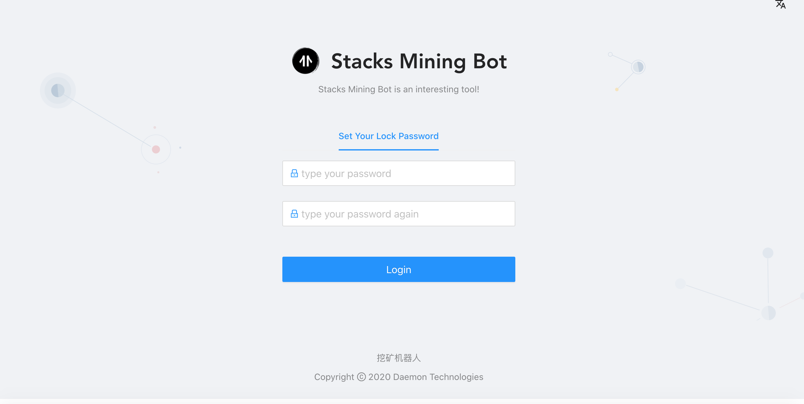

When you log in for the first time, you will be prompted to enter the **Lock Password**. This password is mainly used for login authentication and private key encryption protection. The lock password here has nothing to do with the previous `yarn start node1234` authentication password, and there is no need to keep the same.

After entering the same password twice, you will enter the main page of the mining robot. After entering the main page, you can lock the account through the account status bar in the upper right corner of the figure below.


After clicking **Lock Account,** you will be redirected to the following interface, you need to re-enter the lock password set for the first time to **unlock** the account.


:artificial_satellite:**[Reminder] The password cannot be recovered.**

The main page consists of four parts: the **Public Data** page, the **Wallet** page, the **Mining Client** page, and the **System Configuration** page. Next, we will explain how to obtain mining data through mining bots and participate in mining.

As shown in the figure below, the public data page is designed to provide rich data sources for mining bot strategies, and the public data page is shown in the figure below. At this stage, the following information is included:

- Currency price information: STX, BTC trading pair information
- Chain information
- Block information


​    

## 2. Wallet page

### 2.1 Bitcoin and Stacks address generation online

:artificial_satellite:**[Reminder] If you have a BTC or STX address with 24 mnemonic words, you can choose to skip this section**

This section refers to the instructions for generating online addresses in the [Official Mining Doc](https://docs.blockstack.org/mining)

Run the following command:

``` bash
npx @stacks/cli make_keychain -t
```

After running the above command, you will see a lot of installation logs, at the end you can see a `JSON`, similar to:

```json
{
  "mnemonic": "exhaust spin topic distance hole december impulse gate century absent breeze ostrich armed clerk oak peace want scrap auction sniff cradle siren blur blur",
  "keyInfo": {
    "privateKey": "2033269b55026ff2eddaf06d2e56938f7fd8e9d697af8fe0f857bb5962894d5801",
    "address": "STTX57EGWW058FZ6WG3WS2YRBQ8HDFGBKEFBNXTF",
    "btcAddress": "mkRYR7KkPB1wjxNjVz3HByqAvVz8c4B6ND",
    "index": 0
  }
}
```
:artificial_satellite:**[Reminder] The above information must be saved as core information such as Bitcoin and Stacks private key**

### 2.2 Add account: Bitcoin and Stacks address import
Click the **Add Account** column on the wallet account page, and a dialog box for importing addresses will pop up. Copy and paste the **24 mnemonic words** into the dialog box (separated by spaces), and select the **corresponding type**. The address can be imported.

Click to add an account on the wallet account page:


Copy and paste the **24 mnemonic words** into the dialog box (separated by spaces), select the account type, and click submit:


You can see the newly added address in the list, as well as its corresponding type and account balance.


Get BTC testnet coins: https://testnet-faucet.mempool.co/

**Note**: Switch the network to the **Xenon** test network, the current test network is displayed in the upper right corner of the page.


## 3. Client interface

Enter the client page and see that the current state is Mining-Local Server is running, but the `stacks-node` program is not found.


 


## 4. System configuration interface


If the network is normal, the information of the main chain and the local chain is displayed. You can configure the information such as Mining-Local-Server, local Stacks chain, BTC node to be synchronized, etc.

When starting the mining configuration Bitcoin node, the local node information is filled in, and it will be updated synchronously in the system configuration interface：

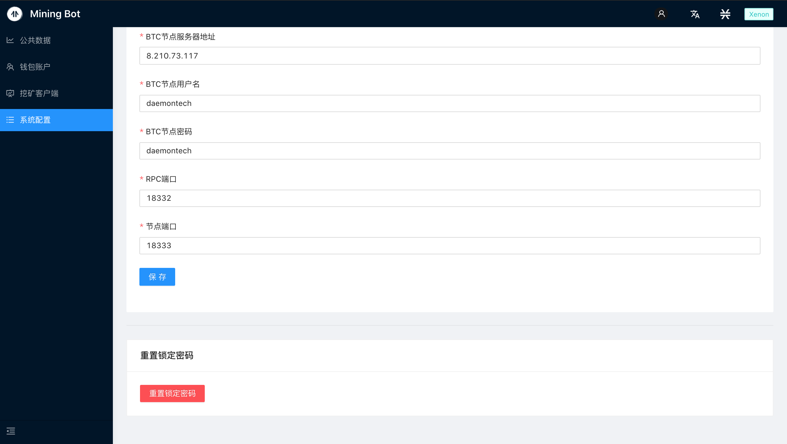


### Reset Lock Password

If you need to reset the information stored locally in Mining-Bot, you can perform a reset operation, which will clear our stored lock password and account information.


After clicking confirm, it will return to the Set Your Lock Password interface:


## 5. Practical Mining Guide

在开启挖矿机器人后，通过访问`http://localhost:8000/`登录后，首先需要清除浏览器缓存。在本教程中，将逐步讲解主网和测试网Xenon上的操作，其中主网上会采用自己的比特币节点，而Xenon上则使用节点池。具体细节会在下面两个小节分别展开。

After start the mining bot, after logging in by visiting `http://localhost:8000/`, you first need to clear the browser cache. In this tutorial, I will explain step by step the operations on the mainnet and testnet Xenon. The mainnet will use its own Bitcoin node, while Xenon will use the node pool. The specific details will be expanded separately in the following two subsections.


### 5.1 主网挖矿步骤

#### 5.1.1 清除浏览器缓存

在主页面右键`检查`，点击`Application->Local Storage->http://localhost:8000/`，右键清除当前网页缓存。


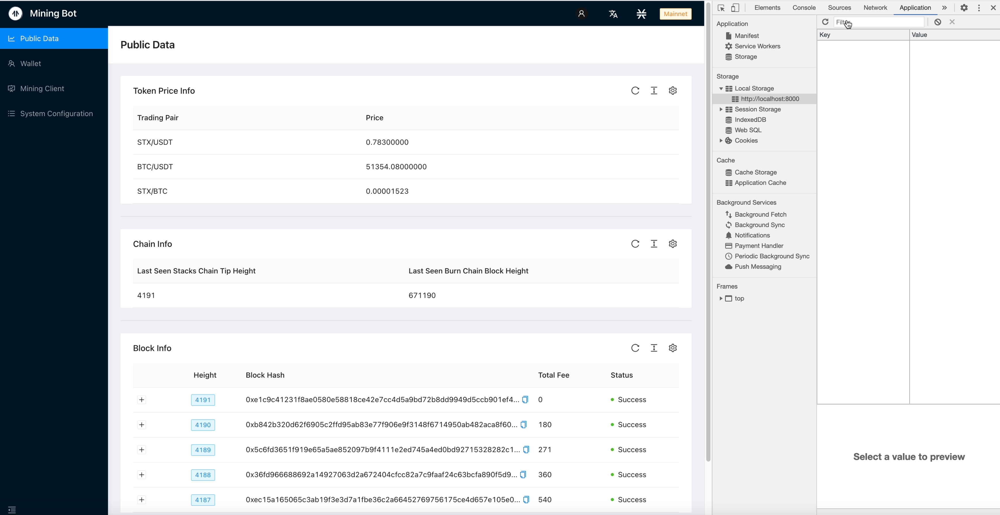

完成后锁定账户并重新输入密码登录。

#### 5.1.2 添加主网钱包地址

切换网络为`Mainnet`，在钱包页面点击添加地址：

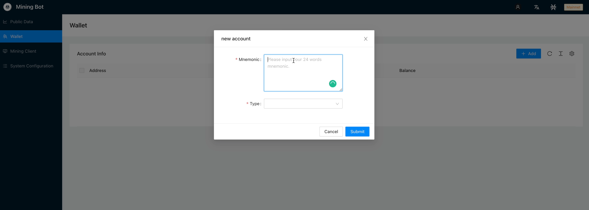

这里导入的比特币地址需要存入一定的比特币，否则无法执行挖矿步骤。

### 5.1.3 系统配置与链信息查询

在初始时未正确配置节点信息，无法获取到链相关的实际信息，因此需要先到系统配置界面将节点信息等配置完成。

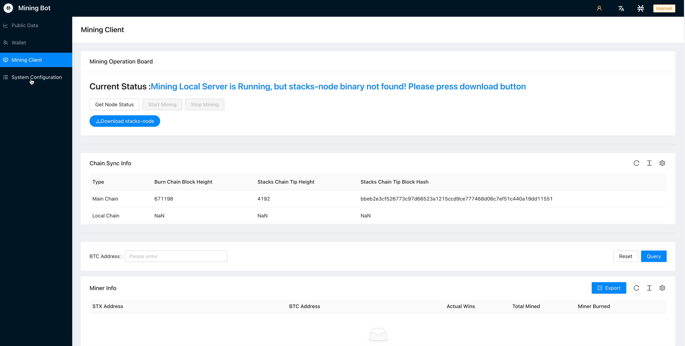

需要注意：

- Mining-Monitor Url: `http://47.242.239.96:8889/`，
- BTC Node Peer Host`: `47.242.239.96 `
- BTC Node Username: `daemontech2`
- BTC Node Password: `daemontech2`
- BTC Node RPC Port: `8332`
- BTC Node Peer Port: `8333`


保存完成后，回到Mining Client界面，刷新可以看到链的信息更新。

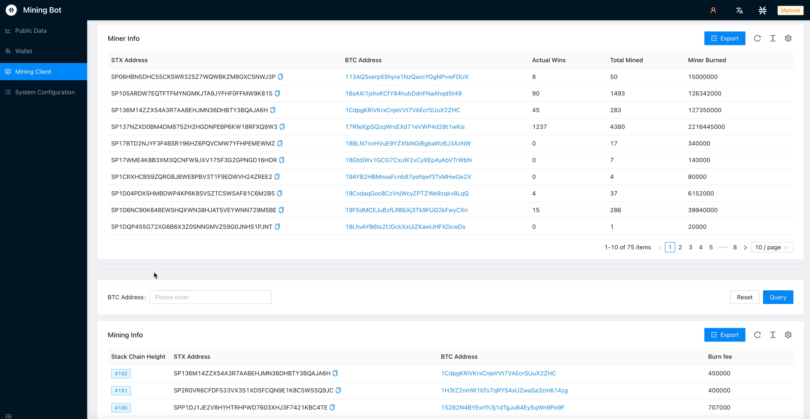

#### 5.1.4 下载stacks-node

在Mining Client界面点击下载stacks-node:


完成后进入下一步挖矿参数配置操作。

#### 5.1.5 配置挖矿参数

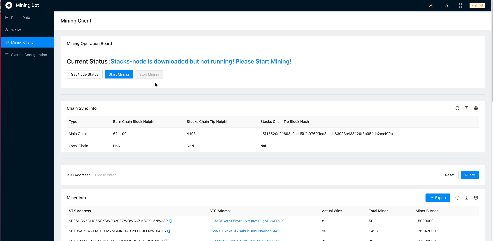


点击开始挖矿按钮，弹出参数配置页面，选择已经导入的账户，调节燃烧费率，并选择节点信息，在主网这里，采用的是系统配置时的本地节点信息。


#### 5.1.6 开始挖矿

配置完成后，输入`node1234`，这是在`yarn start`时配置的认证密码，然后即可开启挖矿程序。 


在命令行查看主网节点信息同步：


同步完成后即开始挖矿。

### 5.2 Xenon测试网挖矿步骤

测试网上采用节点池的配置进行挖矿操作。

#### 5.2.1 切换至Xenon测试网

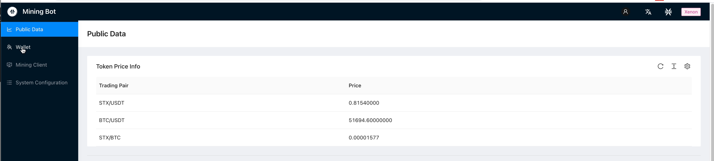


#### 5.2.2 导入测试网钱包账号


输入助记词即可。

#### 5.2.3 下载stacks-node

在Mining Client界面点击下载stacks-node:

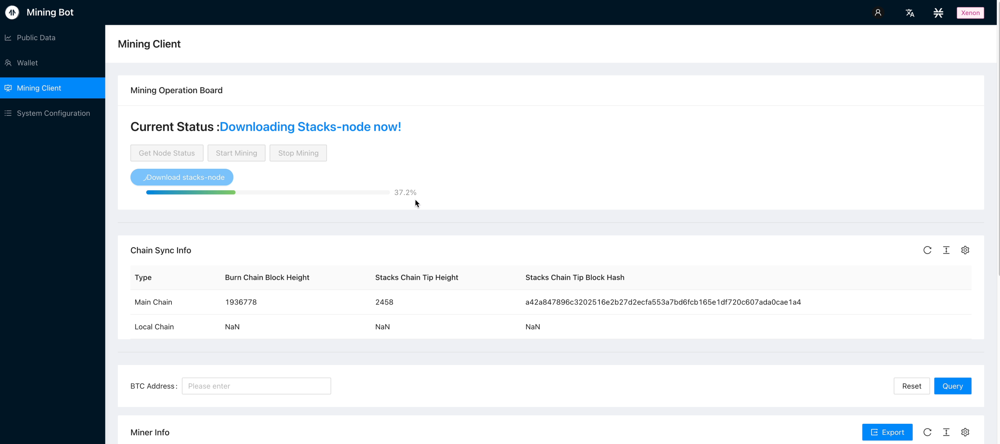


#### 5.2.4 在节点池导入钱包地址

访问：`http://8.210.73.117:8000`，


完成后回到挖矿界面，点击挖矿配置挖矿参数。

#### 5.2.5 配置挖矿参数


点击开始挖矿按钮，弹出参数配置页面，选择已经导入的账户，调节燃烧费率，并选择节点信息，在Xenon测试网这里，下拉选择节点池提供的节点信息。

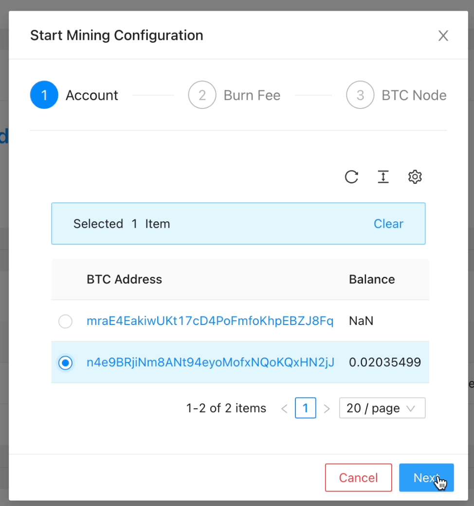
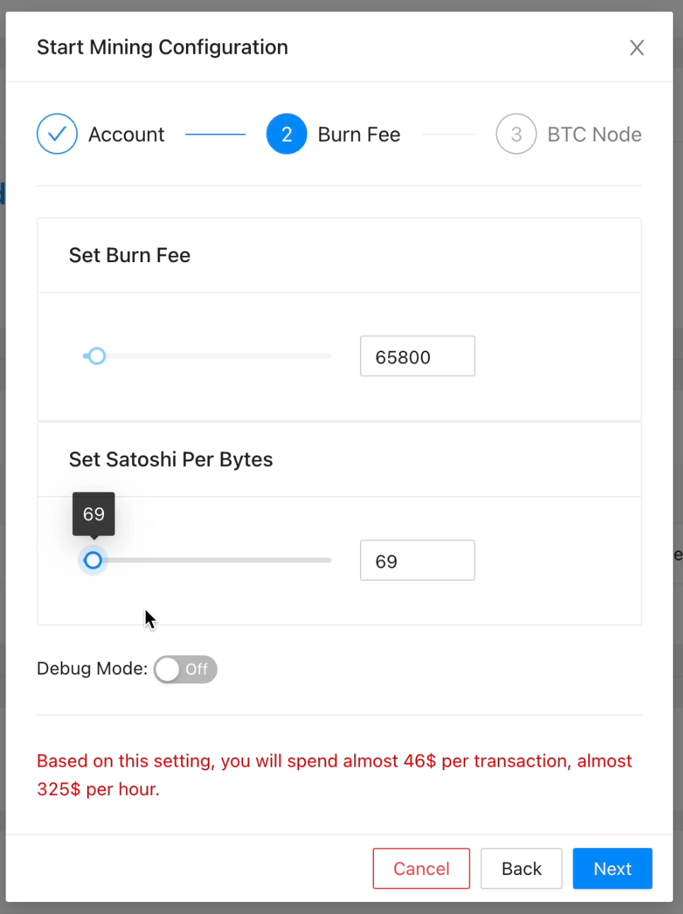


#### 5.2.6 开始挖矿

配置完成后，输入`node1234`，这是在`yarn start`时配置的认证密码，然后即可开启挖矿程序。 


在命令行查看输出：


输出中可以看到`UTXOs found`，表示挖矿节点启动成功，开始挖矿。


