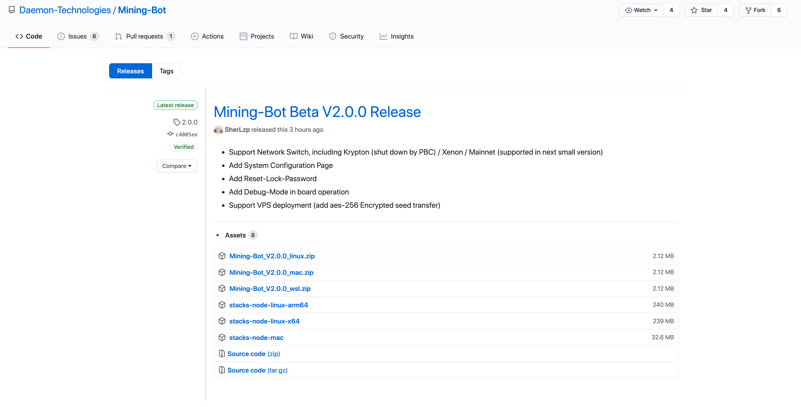

# 挖矿机器人软件安装

本文的目标：演示如何运行Mining Bot Beta版本。

## 环境要求：

确保已经安装：

- `Nodej >= 14`
- `yarn`包管理工具
- `wget`
- `unzip`工具

### 环境安装与配置

#### Node.js和`yarn`的安装

参考：[Node.js和yarn安装参考指南](https://github.com/Daemon-Technologies/docs/blob/master/_draft/Mining-Bot-Alpha-Version/Build-Before-Using/Mining-Bot-Alpha-Tutorial-CN.md)

#### wget的安装

**MacOS上安装**：

```bash
brew install wget
```

**Ubuntu/Debian上安装**，执行：

```bash
apt-get install wget
```

**RHEL，CentOS，Fedora上安装**，执行：

```bash
yum install wget
```

确保安装，检查版本：

```bash
wget --verison
```

#### unzip的安装

**MacOS**： 

```bash
brew install unzip
```

**Ubuntu/Debian上安装**，执行：

```bash
sudo apt install unzip
```

**RHEL，CentOS，Fedora上安装**，执行：

```bash
sudo yum install unzip
```

## Mining-Bot Beta版本安装并运行

### 步骤一：下载安装包

两种下载方式：

- 命令行下载（本文演示）
- 图形界面下载

打开命令行窗口，Win10用户打开新的WSL窗口。

新建一个空目录：

```bash
mkdir stacks-mining
```

目录名可以随便取，这里演示目的，取名为`stacks-mining`。

进入此空目录：

```bash
cd stacks-mining
```

访问链接 ：[Mining-Bot Releases](https://github.com/Daemon-Technologies/Mining-Bot/releases/tag/2.0.0)

进入到Mining-Bot Beta 2.0.0 Release界面：





**选择自己的系统版本进行链接复制与下载**。在本教程中，本地环境为MacOS，选择[Mining-Bot_V2.0.0_mac.zip](https://github.com/Daemon-Technologies/Mining-Bot/releases/download/2.0.0/Mining-Bot_V2.0.0_mac.zip)，右键复制链接：


使用`wget`命令下载对应系统的`zip`文件：

```bash
wget https://github.com/Daemon-Technologies/Mining-Bot/releases/download/2.0.0/Mining-Bot_V2.0.0_mac.zip
```


**或者直接点击对应的版本，直接浏览器下载**，选择存储到当前工作目录：`stacks-mining`。

### 步骤二：解压zip文件

两种方式：

1. 命令行解压（本文演示）
2. 图形界面双击解压，或者右键解压

这里演示第一种命令行解压方式，通过`unzip -d`命令：

```bash
unzip Mining-Bot_V2.0.0_mac.zip -d Mining-Bot-Beta/
```

其中，`-d`表示解压到的目录名称，不存在则新建目录，并将压缩文件内容输出到该文件目录，这里我们输出到当前目录下的`Mining-Bot-Beta`文件夹（会新建此目录）。


### 步骤三：开启程序

进入解压的文件夹：`Mining-Bot-Beta`。

执行命令：`cd Mining-Bot-Beta`

查看文件：`ls`


运行`yarn install`命令或者`npm install`命令，或者直接输入`yarn`命令，安装依赖包，并确保`Nodejs`版本大于14。

安装完成后，出现`node_modules`文件夹。


#### 1.启动Mining-Bot

执行命令：`yarn start node1234`

其中，`node1234`是设置的**认证密码**，在`yarn start`后面配置。

启动成功显示信息如下：


注意：如果使用的是服务器，需要根据自己服务器的`ip地址`来访问`Mining-Bot`。

本机测试时未显示`ip地址`，在Win10上会显示，查询本机`ip地址`可以通过`ifconfig`指令获取。

注意到启动程序后，有两个进程分别在运行，`5000`端口是后台服务进程，`8000`端口是挖矿机器人的客户端进程。

#### 2.访问Mining-Bot

为了访问挖矿机器人，我们只需要复制Mining-Bot Client地址。

浏览器中输入：`http://localhost:8000/`，或者`http://your-ip:8000`，即可访问，如：`http://192.168.31.171:8000/`


当你第一次登陆的时候，会提示让您输入**锁定密码**，该密码主要用于**登陆认证**、**私钥加密保护**，这里的锁定密码和之前的yarn start node1234认证密码没有关系，没有必要保持一致。

至此，程序安装成功，后面步骤将会在浏览器页面操作，请参考[用户手册](../Use-Mining-Bot-For-Mining/User's-Guide-of-Mining-Bot-Beta-CN).

