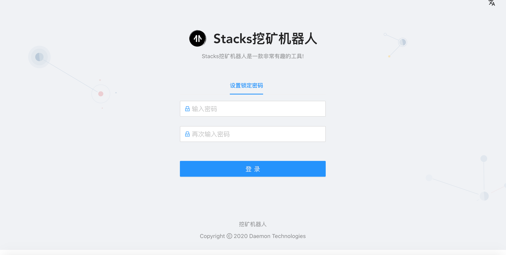
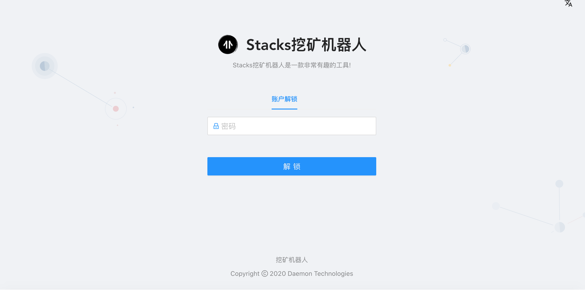
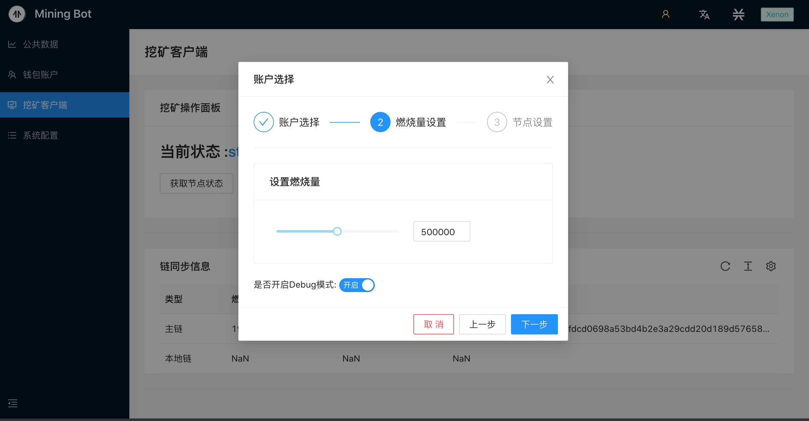
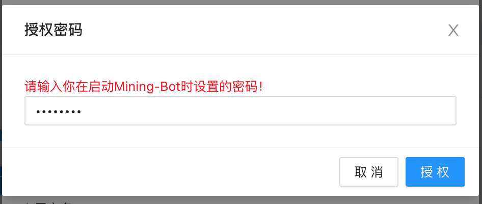
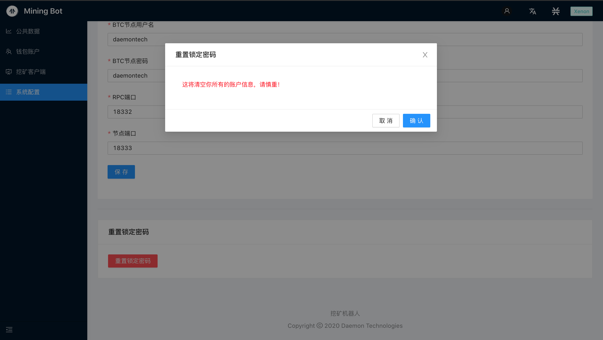

# 挖矿机器人使用说明书 - Beta版

本教程将会介绍如何使用挖矿机器人进行STX挖矿。

- [前序环境搭建教程](../Build-Before-Using/Mining-Bot-Beta-Tutorial-CN.md)

**【提醒】具体的使用说明大家可以参照视频。**

- [Stacks挖矿机器人客户端2.0版](https://www.bilibili.com/video/BV18z4y167ss/)

## 1. 登陆页面介绍

当你在浏览器中输入 **http://localhost:8000/** 的时候，会看到如下界面：




当你第一次登陆的时候，会提示让您输入**锁定密码**，该密码主要用于**登陆认证**、**私钥加密保护**，这里的锁定密码和之前的yarn start node1234认证密码没有关系，没有必要保持一致。

当输入两次相同的密码后，就会进入挖矿机器人的主页面。进入主页面后可以通过下图中右上角的账户状态栏进行账户锁定。


点击**锁定账户**后会跳转到如下界面，需要重新输入第一次设置的锁定密码进行账户解锁。



:artificial_satellite:**【提醒】该密码无法被恢复**

主页面由四个部分组成：**公开数据页面**、**钱包账户页面**、与**挖矿客户端页面**，**以及系统配置页面**，接下来将逐个页面讲解如何通过挖矿机器人获取挖矿数据并参与挖矿。

如下图所示，公开数据页面旨在为挖矿机器人策略提供丰富的数据来源，公开数据页面如上图所示。现阶段包含如下信息：
- 币价信息：STX、BTC交易对信息

- 矿工信息

- 挖矿信息

- 链信息

- 区块信息


​    

## 2. 钱包页面

### 2.1 比特币与Stacks地址在线生成

### 比特币与Stacks地址在线生成

:artificial_satellite:**【提醒】如果你有24助记词的BTC或STX地址，可以选择跳过本节**

本小节参考[官方挖矿文档](https://docs.blockstack.org/mining)中对于生成在线地址的指令。

运行如下指令：

``` 
npx @stacks/cli make_keychain -t
```

运行上述指令后会看到很多安装日志，在最后你可以看到一个JSON，类似于：

```
{
  "mnemonic": "exhaust spin topic distance hole december impulse gate century absent breeze ostrich armed clerk oak peace want scrap auction sniff cradle siren blur blur",
  "keyInfo": {
    "privateKey": "2033269b55026ff2eddaf06d2e56938f7fd8e9d697af8fe0f857bb5962894d5801",
    "address": "STTX57EGWW058FZ6WG3WS2YRBQ8HDFGBKEFBNXTF",
    "btcAddress": "mkRYR7KkPB1wjxNjVz3HByqAvVz8c4B6ND",
    "index": 0
  }
}
```
:artificial_satellite:**【提醒】上述信息请务必保存，为比特币、Stacks私钥等核心信息**

### 2.2 添加账户：比特币与Stacks地址导入
点击钱包账户页面中的**添加账户**一栏，会弹出导入地址的对话框，将24个助记词按照拷贝粘贴至对话框中（助记词之间用空格隔开），并选择相应类型，便可完成地址导入。

在钱包账户页面中点击**添加账户**：


将24个助记词按照拷贝粘贴至对话框中（助记词之间用空格隔开），并选择账户类型，点击提交：


可以在列表中看到新增的地址，以及其对应的类型与账户余额。


**获取BTC测试币：**https://testnet-faucet.mempool.co/

注意：将网络切换为Xenon测试网络，在页面的右上角显示的是当前的测试网。


## 3. 客户端界面

进入客户端 页面，看到当前状态为Mining-Local Server已运行，但是`stacks-node`程序未找到。


 

### 3.1 下载stacks-node

点击`下载stacks-node`按钮等待下载。


下载完成后，状态发生变化，满足挖矿条件：


### 3.2 开始挖矿

账户选择：


燃烧量设置与是否开启Debug模式：




开启Debug模式，可以在挖矿开始后命令行界面看到更多输出信息。


配置要同步的BTC节点信息：


点击完成后，弹出授权密码窗口：



本例中，输入：`node1234`，点击授权后，等待一定的时间界面自动跳转，即可进入挖矿。

检查挖矿状态：


启动成功，可以看到状态界面显示出了自己的挖矿地址。

服务端信息：


服务端正在运行中。


## 4. 系统配置界面


如果网络正常，显示的是主链和本地链的信息，可以进行如Mining-Local-Server、本地Stacks链、要同步的BTC节点等信息的配置。

在启动挖矿配置比特币节点时，填入了本地的节点信息，会在系统配置界面进行同步更新。


### 重置锁定密码

如果需要重置Mining-Bot本地存储的信息，可以进行重置操作，这将清空我们存储的锁定密码和账户信息。




点击确认 后，会回到界面：


以上就是所有的操作。

