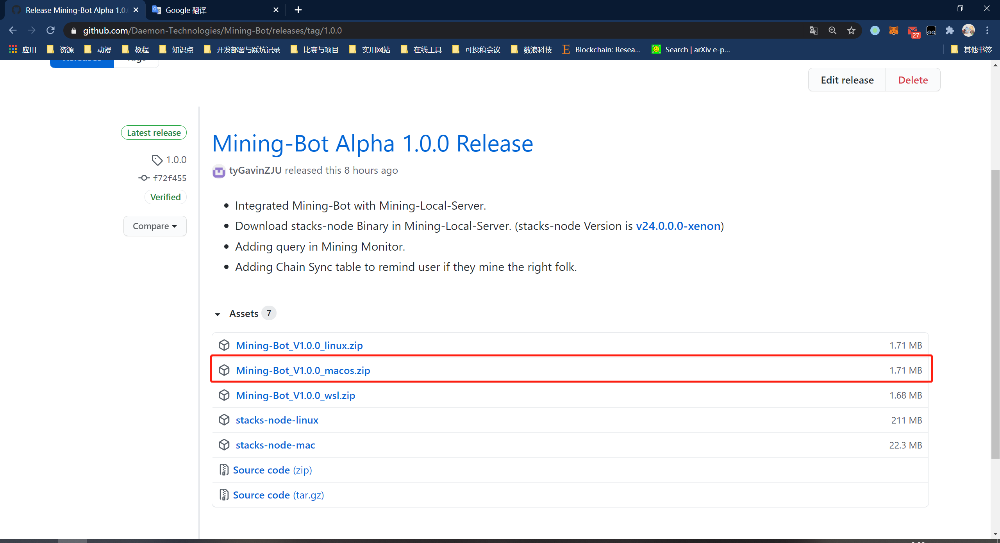
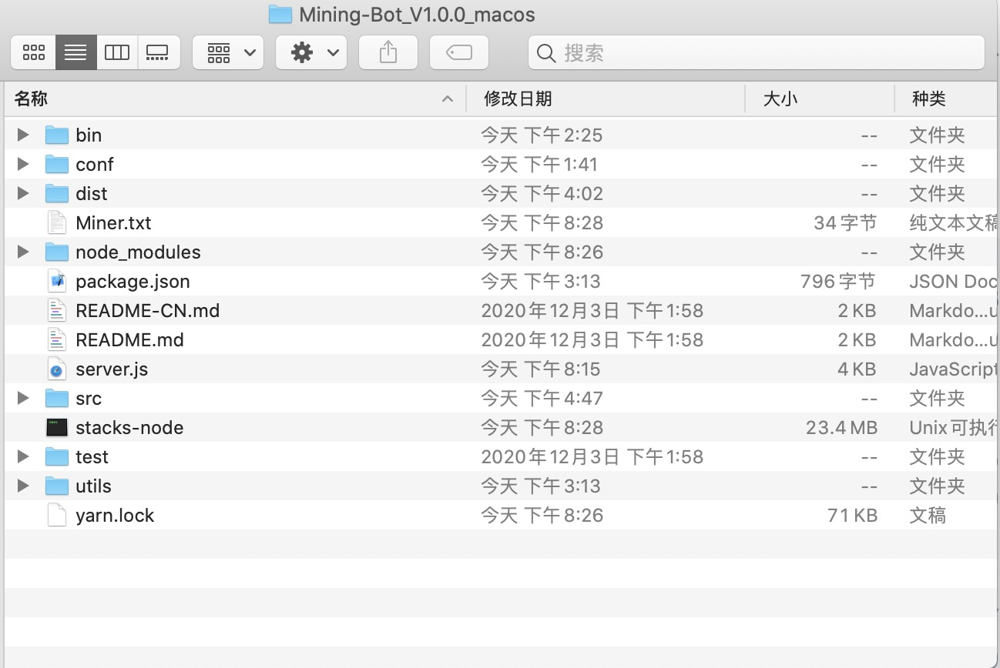
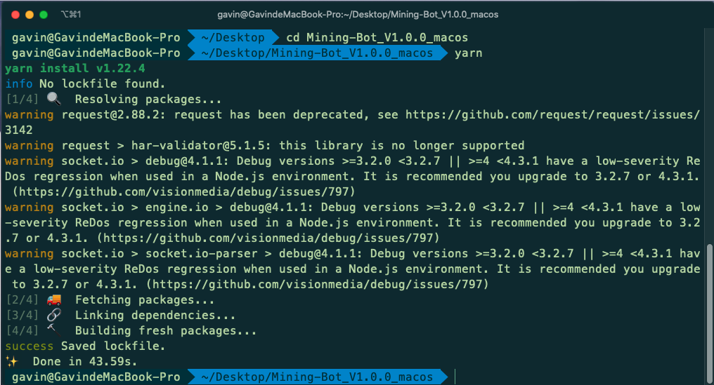
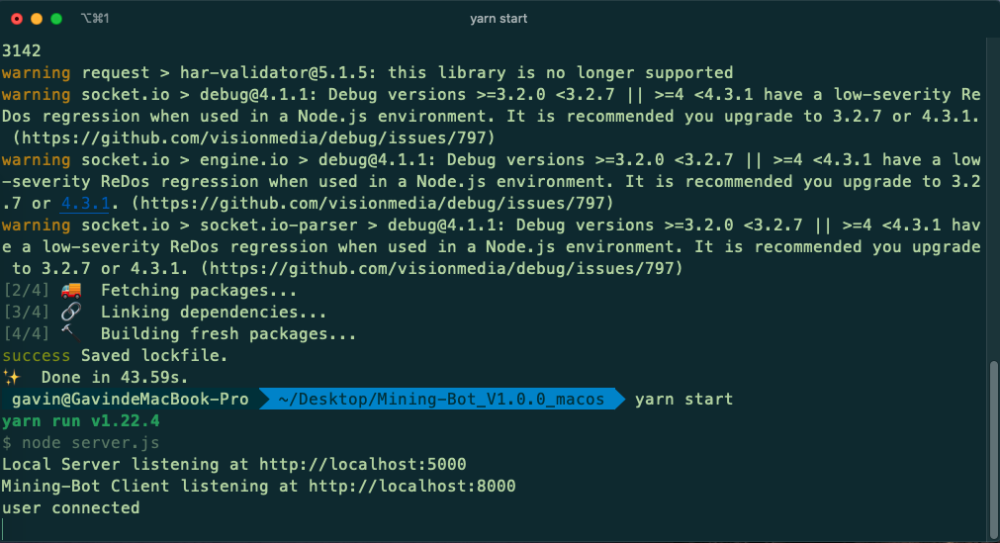
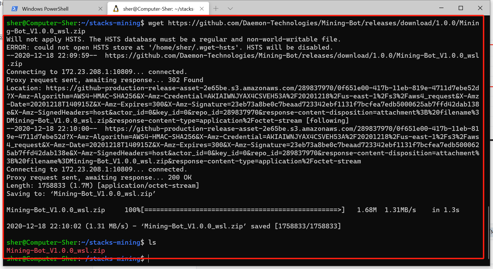
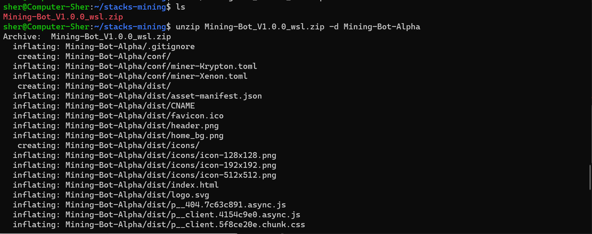
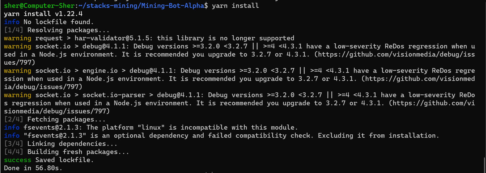
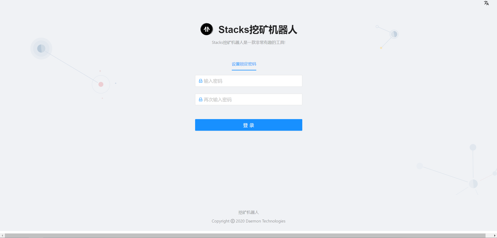

# 运行挖矿机器人

本文将会教你如何配置并且运行挖矿机器人。

**【提醒】如果你不是第一次运行挖矿机器人，请查阅[重启Mining-Bot](#重启Mining-Bot)。**

**【提醒】建议全程保持科学上网。**

**【提醒】如果想获取更全面的信息，请查看我们的视频教程。**
- [Windows 教程](https://www.bilibili.com/video/BV1Lp4y167jd)
- [MacOS 教程](https://www.bilibili.com/video/BV11X4y1u7sL)

## 介绍

本教程会带你经历以下步骤：

- 下载并安装Nodejs
- 运行Mining-Bot

:artificial_satellite:**【提示】如果你的操作系统是`Windows10`系统，你需要使用[WSL](https://docs.microsoft.com/en-us/windows/wsl/install-win10)（推荐使用Ubuntu18系统）来安装并运行挖矿机器人。（Mining-Bot使用基于UNIX的指令与stacks-node进行交互，不支持Windows原生指令）**

:artificial_satellite:**【提示】如果操作系统低于`Windows10`，我们将无法提供相应的支持**


## 环境安装与配置

### Nodejs

我们推荐你使用`nvm`来控制Nodejs的版本并进行nodejs的安装。本教程来自[nvm官方文档](https://github.com/nvm-sh/nvm)，如果想获取更详细的信息请查阅链接中的文档。

为了安装或更新`nvm`，你需要运行[安装脚本](https://github.com/nvm-sh/nvm/blob/v0.37.0/install.sh)。你需要下载或者直接手动运行脚本，或者可以通过以下两种命令的任意一种来进行安装：

```shell
curl -o- https://raw.githubusercontent.com/nvm-sh/nvm/v0.37.0/install.sh | bash
```

或

```shell
wget -qO- https://raw.githubusercontent.com/nvm-sh/nvm/v0.37.0/install.sh | bash
```

然后你可以使用以下命令来检验是否`nvm`安装成功：

```shell
nvm
```

如果安装成功，输出内容会跟下面类似：

```shell
Node Version Manager

Note: <version> refers to any version-like string nvm understands. This includes:
  - full or partial version numbers, starting with an optional "v" (0.10, v0.1.2, v1)
  - default (built-in) aliases: node, stable, unstable, iojs, system
  - custom aliases you define with `nvm alias foo`

 Any options that produce colorized output should respect the `--no-colors` option.

Usage:
  nvm --help                                Show this message
  nvm --version                             Print out the installed version of nvm
  nvm install [-s] <version>                Download and install a <version>, [-s] from source. Uses .nvmrc if available
    --reinstall-packages-from=<version>     When installing, reinstall packages installed in <node|iojs|node version number>
    --lts                                   When installing, only select from LTS (long-term support) versions
    --lts=<LTS name>                        When installing, only select from versions for a specific LTS line
    --skip-default-packages                 When installing, skip the default-packages file if it exists
    --latest-npm                            After installing, attempt to upgrade to the latest working npm on the given node version
    --no-progress                           Disable the progress bar on any downloads
  nvm uninstall <version>                   Uninstall a version
  nvm uninstall --lts                       Uninstall using automatic LTS (long-term support) alias `lts/*`, if available.
  nvm uninstall --lts=<LTS name>            Uninstall using automatic alias for provided LTS line, if available.
  nvm use [--silent] <version>              Modify PATH to use <version>. Uses .nvmrc if available
    --lts                                   Uses automatic LTS (long-term support) alias `lts/*`, if available.
    --lts=<LTS name>                        Uses automatic alias for provided LTS line, if available.
  nvm exec [--silent] <version> [<command>] Run <command> on <version>. Uses .nvmrc if available
    --lts                                   Uses automatic LTS (long-term support) alias `lts/*`, if available.
    --lts=<LTS name>                        Uses automatic alias for provided LTS line, if available.
  nvm run [--silent] <version> [<args>]     Run `node` on <version> with <args> as arguments. Uses .nvmrc if available
    --lts                                   Uses automatic LTS (long-term support) alias `lts/*`, if available.
    --lts=<LTS name>                        Uses automatic alias for provided LTS line, if available.
  nvm current                               Display currently activated version of Node
  nvm ls                                    List installed versions
  nvm ls <version>                          List versions matching a given <version>
  nvm ls-remote                             List remote versions available for install
    --lts                                   When listing, only show LTS (long-term support) versions
  nvm ls-remote <version>                   List remote versions available for install, matching a given <version>
    --lts                                   When listing, only show LTS (long-term support) versions
    --lts=<LTS name>                        When listing, only show versions for a specific LTS line
  nvm version <version>                     Resolve the given description to a single local version
  nvm version-remote <version>              Resolve the given description to a single remote version
    --lts                                   When listing, only select from LTS (long-term support) versions
    --lts=<LTS name>                        When listing, only select from versions for a specific LTS line
  nvm deactivate                            Undo effects of `nvm` on current shell
  nvm alias [<pattern>]                     Show all aliases beginning with <pattern>
  nvm alias <name> <version>                Set an alias named <name> pointing to <version>
  nvm unalias <name>                        Deletes the alias named <name>
  nvm install-latest-npm                    Attempt to upgrade to the latest working `npm` on the current node version
  nvm reinstall-packages <version>          Reinstall global `npm` packages contained in <version> to current version
  nvm unload                                Unload `nvm` from shell
  nvm which [current | <version>]           Display path to installed node version. Uses .nvmrc if available
  nvm cache dir                             Display path to the cache directory for nvm
  nvm cache clear                           Empty cache directory for nvm

Example:
  nvm install 8.0.0                     Install a specific version number
  nvm use 8.0                           Use the latest available 8.0.x release
  nvm run 6.10.3 app.js                 Run app.js using node 6.10.3
  nvm exec 4.8.3 node app.js            Run `node app.js` with the PATH pointing to node 4.8.3
  nvm alias default 8.1.0               Set default node version on a shell
  nvm alias default node                Always default to the latest available node version on a shell

Note:
  to remove, delete, or uninstall nvm - just remove the `$NVM_DIR` folder (usually `~/.nvm`)
```

然后你可以使用以下命令来安装Nodejs：

```shell
nvm install 14.15.0
```

然后使用以下命令检查`node`和`npm`是否安装成功：

```shell
# node命令
node -v
# node版本输出
v14.15.0
# npm命令
npm -v
# npm版本输出
6.14.8
```

然后我们使用`npm`来安装`yarn`：

```shell
npm install -g yarn
```

来检验`yarn`是否安装成功：

```shell
# 使用如下命令
yarn -v
# 版本输出
1.22.4
```

## 运行Mining-Bot

我们针对不同系统的用户有不同的教程：

### Mac用户

首先，用浏览器打开[Mining-Bot Alpha Release](https://github.com/Daemon-Technologies/Mining-Bot/releases/tag/1.0.0)页面：



请**下载图片中红框内对应的文件并进行解压**：

- mac用户：[Mining-Bot_V1.0.0_macos.zip](https://github.com/Daemon-Technologies/Mining-Bot/releases/download/1.0.0/Mining-Bot_V1.0.0_macos.zip)




然后进入解压后的目录：

```shell
cd Mining-Bot_V1.0.0_macos
```

然后安装依赖包，【注意】此处需要用`yarn`命令进行安装：

```shell
yarn install
```

:warning:**此过程会花费一定的时间来完成。**



通过`yarn`命令运行Mining-Bot

```shell
yarn start
```

如果你看到类似如下输出则代表Mining-Bot已成功启动：

```shell
yarn run v1.22.4
$ node server.js
Local Server listening at http://localhost:5000
Mining-Bot Client listening at http://localhost:8000
```



### Linux或WSL用户

**这里以WSL用户为例**（**区别就在于下载的文件**，linux用户需要下载的文件是`Mining-Bot_V1.0.0_linux.zip`）。

首先，使用`wget`命令进行下载，如下：

```shell
wget https://github.com/Daemon-Technologies/Mining-Bot/releases/download/1.0.0/Mining-Bot_V1.0.0_wsl.zip
```



然后使用`unzip`命令进行解压：

```shell
unzip Mining-Bot_V1.0.0_wsl.zip -d Mining-Bot-Alpha
```



然后进入解压后的目录：

```shell
cd Mining-Bot-Alpha
```

然后安装依赖包，【注意】此处需要用`yarn`命令进行安装：

```shell
yarn install
```

:warning:**此过程会花费一定的时间来完成。**



通过`yarn`命令运行Mining-Bot

```shell
yarn start
```

如果你看到类似如下输出则代表Mining-Bot已成功启动：

```shell
yarn run v1.22.4
$ node server.js
Local Server listening at http://localhost:5000
Mining-Bot Client listening at http://localhost:8000
```

如果你是WSL用户你将会看到类似如下的输出（`ip`地址而非`localhost`）：

```shell
yarn run v1.22.4
$ node server.js
Local Server listening at http://172.23.215.133:5000
Mining-Bot Client listening at http://172.23.215.133:8000
```

然后你可以在浏览器打开http://localhost:8000并会看到如下界面的话：

**【提示】WSL用户需要使用启动时给定的IP地址和端口（如上面是`http://172.23.215.133:8000`）在浏览器中打开。**




恭喜你！你已经完成了Mining-Bot的启动，接下来可以开启你的挖矿之旅了。

## 重启Mining-Bot

如果你已经成功运行Mining-Bot并且已经停掉了所有相关程序。现在我们将教你如何再次运行Mining-Bot。如果你是Windows用户，请使用[WSL](https://docs.microsoft.com/en-us/windows/wsl/install-win10)（推荐使用Ubuntu18系统）来进行如下操作。确保你已经停掉了挖矿程序（你可以使用`Ctrl+C`来停止这些程序）。

**【提醒】确保你已经成功完成上述教程并成功运行程序，并关闭了所有上述已启动的程序。**

### 运行Mining-Bot

打开一个新窗口然后**进入你当时zip文件的解压目录**，此处以`Mining-Bot-Alpha`为例：

```shell
cd Mining-Bot-Alpha
```

启动Mining-Bot-Alpha：

```shell
yarn start
```

如果你看到类似如下输出则代表已成功启动：

```shell
yarn run v1.22.4
$ node server.js
Local Server listening at http://localhost:5000
Mining-Bot Client listening at http://localhost:8000
```

如果你是WSL用户你将会看到类似如下的输出（`ip`地址而非`localhost`）：

```shell
yarn run v1.22.4
$ node server.js
Local Server listening at http://172.23.215.133:5000
Mining-Bot Client listening at http://172.23.215.133:8000
```

然后你可以在浏览器打开http://localhost:8000并会看到如下界面的话：

**【提示】WSL用户需要使用启动时给定的IP地址和端口（如上面是`http://172.23.215.133:8000`）在浏览器中打开。**


