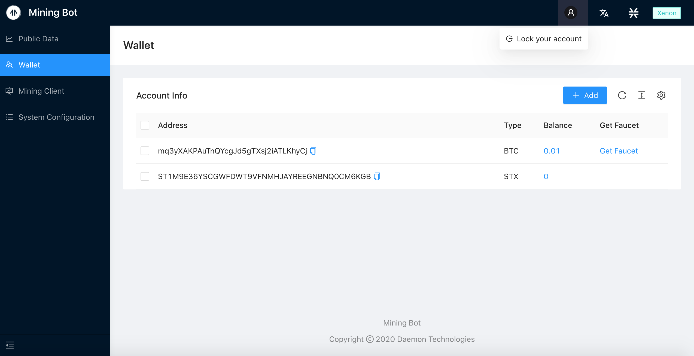
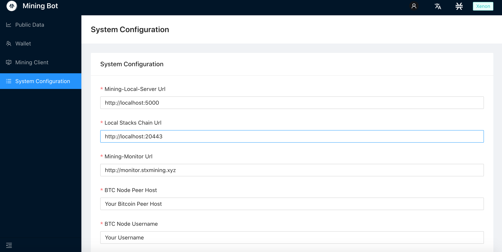

# User Guide of Mining-Bot: Beta Version

This tutorial will introduce how to use mining bot for STX mining.

- [Previous Environment Setup Tutorial](../Build-Before-Using/Mining-Bot-Beta-Tutorial-EN.md)

:artificial_satellite:**[Reminder] Please refer to the video for specific instructions.**

- [Stacks Mining Bot Client version 2.1.0-Xenon Testnet](https://www.youtube.com/watch?v=_bWLbvDjj9g)
- [Stacks Mining Bot Client version 2.1.0-Mainnet](https://www.youtube.com/watch?v=8uk21KldZYI)

## 1. Login Page Introduction

When you input **http://localhost:8000/** in your browser, you will see the following interface:


When you log in for the first time, you will be prompted to enter the **Lock Password**. This password is mainly used for login authentication and private key encryption protection. The lock password here has nothing to do with the previous `yarn start node1234` authentication password, and there is no need to keep the same.

After entering the same password twice, you will enter the main page of the mining robot. After entering the main page, you can lock the account through the account status bar in the upper right corner of the figure below.




After clicking **Lock Account,** you will be redirected to the following interface, you need to re-enter the lock password set for the first time to **unlock** the account.


:artificial_satellite:**[Reminder] The password cannot be recovered.**

The main page consists of four parts: the **Public Data** page, the **Wallet** page, the **Mining Client** page, and the **System Configuration** page. Next, we will explain how to obtain mining data through mining bots and participate in mining.

As shown in the figure below, the public data page is designed to provide rich data sources for mining bot strategies, and the public data page is shown in the figure below. At this stage, the following information is included:

- Currency price information: STX, BTC trading pair information
- Chain information
- Block information


​    

## 2. Wallet page

### 2.1 Bitcoin and Stacks address generation online

:artificial_satellite:**[Reminder] If you have a BTC or STX address with 24 mnemonic words, you can choose to skip this section**

This section refers to the instructions for generating online addresses in the [Official Mining Doc](https://docs.blockstack.org/mining)

Run the following command:

``` bash
npx @stacks/cli make_keychain -t
```

After running the above command, you will see a lot of installation logs, at the end you can see a `JSON`, similar to:

```json
{
  "mnemonic": "exhaust spin topic distance hole december impulse gate century absent breeze ostrich armed clerk oak peace want scrap auction sniff cradle siren blur blur",
  "keyInfo": {
    "privateKey": "2033269b55026ff2eddaf06d2e56938f7fd8e9d697af8fe0f857bb5962894d5801",
    "address": "STTX57EGWW058FZ6WG3WS2YRBQ8HDFGBKEFBNXTF",
    "btcAddress": "mkRYR7KkPB1wjxNjVz3HByqAvVz8c4B6ND",
    "index": 0
  }
}
```
:artificial_satellite:**[Reminder] The above information must be saved as core information such as Bitcoin and Stacks private key**

### 2.2 Add account: Bitcoin and Stacks address import
Click the **Add Account** column on the wallet account page, and a dialog box for importing addresses will pop up. Copy and paste the **24 mnemonic words** into the dialog box (separated by spaces), and select the **corresponding type**. The address can be imported.

Click to add an account on the wallet account page:


Copy and paste the **24 mnemonic words** into the dialog box (separated by spaces), select the account type, and click submit:


You can see the newly added address in the list, as well as its corresponding type and account balance.


Get BTC testnet coins: https://testnet-faucet.mempool.co/

**Note**: Switch the network to the **Xenon** test network, the current test network is displayed in the upper right corner of the page.


## 3. Client interface

Enter the client page and see that the current state is Mining-Local Server is running, but the `stacks-node` program is not found.


 


## 4. System configuration interface




If the network is normal, the information of the main chain and the local chain is displayed. You can configure the information such as Mining-Local-Server, local Stacks chain, BTC node to be synchronized, etc.

When starting the mining configuration Bitcoin node, the local node information is filled in, and it will be updated synchronously in the system configuration interface：


### Reset Lock Password

If you need to reset the information stored locally in Mining-Bot, you can perform a reset operation, which will clear our stored lock password and account information.


After clicking confirm, it will return to the Set Your Lock Password interface:


## 5.Practical Mining Guide

After starting the mining bot, logging in by visiting `http://localhost:8000/`, first we need to clear the browser cache. In this tutorial, we will walk through the operations on the `Mainnet` and `Xenon` testnet. The `Mainnet` will use a local Bitcoin node, while `Xenon` will use the node pool. The specific details will be expanded separately in the following two subsections.


### 5.1 Steps for mining on Mainnet

#### 5.1.1 Clear browser cache


Right-click `Inspect` on the main page, go to `Application->Local Storage->http://localhost:8000/`, right-click to clear the current webpage cache.


After completion, lock the account and re-enter the password to log in.

#### 5.1.2 Add Mainnet wallet address

Switch the network to `Mainnet`, click to add an address on the wallet page:


The bitcoin address imported here needs to be deposited in a certain amount of bitcoin, otherwise the following mining step cannot be performed.

### 5.1.3 System configuration and chain information query


The node information is not configured correctly at the beginning, and the actual information related to the chain cannot be obtained. Therefore, we need to first go to the system configuration interface to complete the configuration of the node information.


Fields to be configured:

- Mining-Monitor Url
- BTC Node Peer Host
- BTC Node Username
- BTC Node Password
- BTC Node RPC Port
- BTC Node Peer Port


The following is a configuration example:


The circled fields need to be provided by users.

**Note: Daemon Technology does not provide mainnet bitcoin node**.

When saved, return to the Mining Client interface and refresh to see the chain information updated.


#### 5.1.4 Download stacks-node


Click to download `stacks-node` on the Mining Client interface:


When completed, proceed to the next step of mining parameter configuration operation.

#### 5.1.5 Configure mining parameters


Click the `Start Mining` button to pop up the parameter configuration page, select the account that has been imported, adjust the burning fee, and select the node information. In `Mainnet`, the local node information during system configuration is used.


The Bitcoin node information needs to be provided by users.


#### 5.1.6 Start mining


After the configuration is complete, enter `node1234`, which is the authentication password configured during `yarn start`, and then you can start the mining program.


View the synchronization of Mainnet block information on the command line:


Mining will start after synchronization is complete.

### 5.2 Xenon testnet mining steps

The testnet uses the configuration of the node pool for mining operations.

#### 5.2.1 Switch to Xenon testnet


#### 5.2.2 Import testnet wallet account


Input the `mnemonic`.

#### 5.2.3 Download stacks-node

Click to download `stacks-nod`e on the Mining Client interface:


#### 5.2.4 Import wallet address in node pool

Access：`http://8.210.73.117:8000`，


When completed, return to the Mining Client interface and click Start Mining to configure mining parameters.

#### 5.2.5 Configure mining parameters


Click the Start Mining button to pop up the parameter configuration page.

Select the account that has been imported:


Adjust the burning fee:


And select the node information, in the Xenon testnet, drop down to select the node information provided by the node pool:


#### 5.2.6 Start mining


After the configuration is complete, enter `node1234`, which is the authentication password configured during `yarn start`, and then you can start the mining program.


View the output on the command line:


You can see `UTXOs found` in the output, indicating that the mining node has been successfully started and mining has started.