# User Guide of Mining-Bot: Beta Version

This tutorial will introduce how to use mining bot for STX mining.

- [Previous Environment Setup Tutorial](../Build-Before-Using/Mining-Bot-Beta-Tutorial-EN.md)

:artificial_satellite:**[Reminder] Please refer to the video for specific instructions.**

- [Stacks Mining Bot Client version 2.0.0](https://www.bilibili.com/video/BV18z4y167ss/)

## 1. Login Page Introduction

When you input **http://localhost:8000/** in your browser, you will see the following interface:

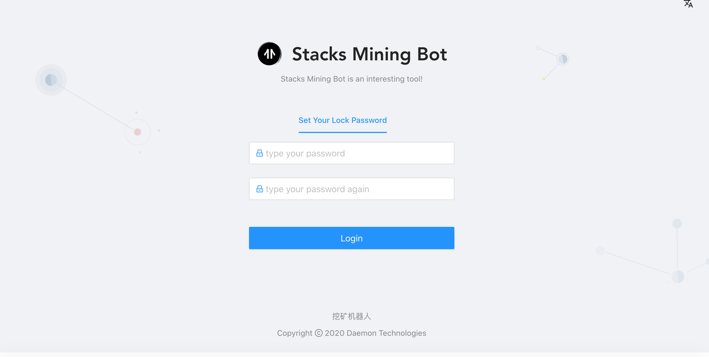

When you log in for the first time, you will be prompted to enter the **Lock Password**. This password is mainly used for login authentication and private key encryption protection. The lock password here has nothing to do with the previous `yarn start node1234` authentication password, and there is no need to keep the same.

After entering the same password twice, you will enter the main page of the mining robot. After entering the main page, you can lock the account through the account status bar in the upper right corner of the figure below.


After clicking **Lock Account,** you will be redirected to the following interface, you need to re-enter the lock password set for the first time to **unlock** the account.


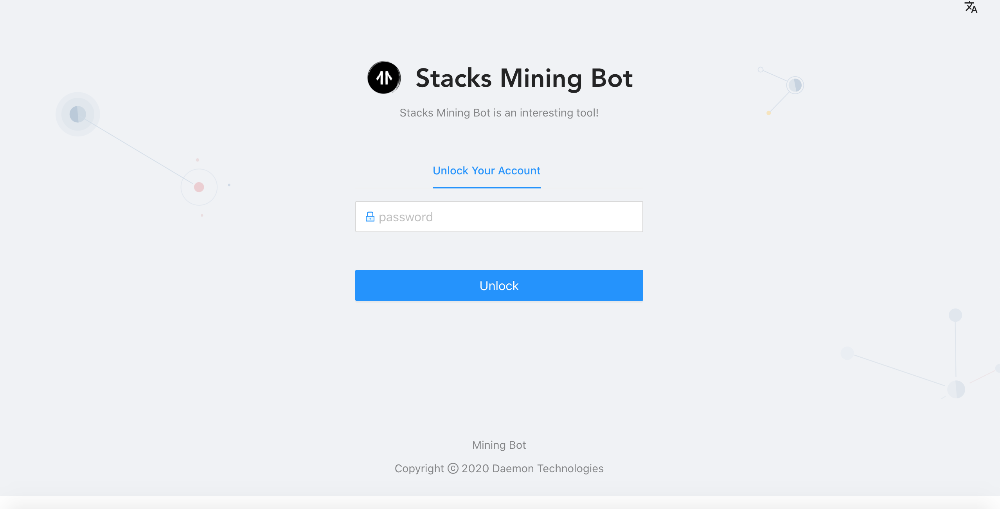

:artificial_satellite:**[Reminder] The password cannot be recovered.**

The main page consists of four parts: the **Public Data** page, the **Wallet** page, the **Mining Client** page, and the **System Configuration** page. Next, we will explain how to obtain mining data through mining bots and participate in mining.

As shown in the figure below, the public data page is designed to provide rich data sources for mining bot strategies, and the public data page is shown in the figure below. At this stage, the following information is included:

- Currency price information: STX, BTC trading pair information
- Miner information
- Mining information
- Chain information
- Block information

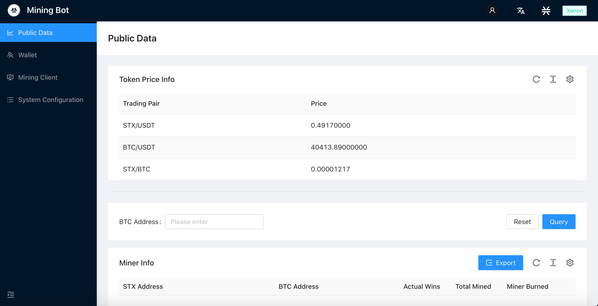

​    

## 2. Wallet page

### 2.1 Bitcoin and Stacks address generation online

:artificial_satellite:**[Reminder] If you have a BTC or STX address with 24 mnemonic words, you can choose to skip this section**

This section refers to the instructions for generating online addresses in the [Official Mining Doc](https://docs.blockstack.org/mining)

Run the following command:

``` bash
npx @stacks/cli make_keychain -t
```

After running the above command, you will see a lot of installation logs, at the end you can see a `JSON`, similar to:

```json
{
  "mnemonic": "exhaust spin topic distance hole december impulse gate century absent breeze ostrich armed clerk oak peace want scrap auction sniff cradle siren blur blur",
  "keyInfo": {
    "privateKey": "2033269b55026ff2eddaf06d2e56938f7fd8e9d697af8fe0f857bb5962894d5801",
    "address": "STTX57EGWW058FZ6WG3WS2YRBQ8HDFGBKEFBNXTF",
    "btcAddress": "mkRYR7KkPB1wjxNjVz3HByqAvVz8c4B6ND",
    "index": 0
  }
}
```
:artificial_satellite:**[Reminder] The above information must be saved as core information such as Bitcoin and Stacks private key**

### 2.2 Add account: Bitcoin and Stacks address import
Click the **Add Account** column on the wallet account page, and a dialog box for importing addresses will pop up. Copy and paste the **24 mnemonic words** into the dialog box (separated by spaces), and select the **corresponding type**. The address can be imported.

Click to add an account on the wallet account page:

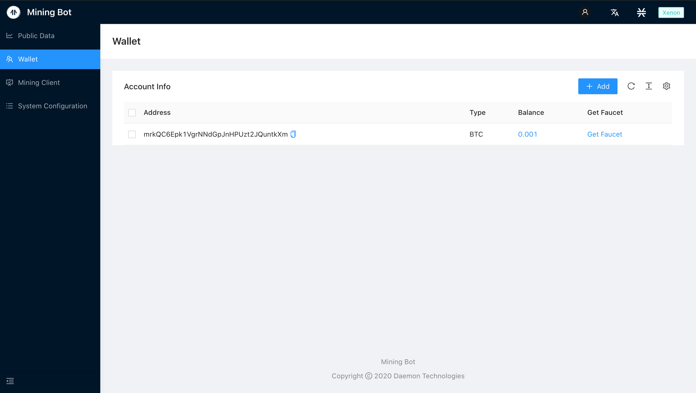


Copy and paste the **24 mnemonic words** into the dialog box (separated by spaces), select the account type, and click submit:


You can see the newly added address in the list, as well as its corresponding type and account balance.

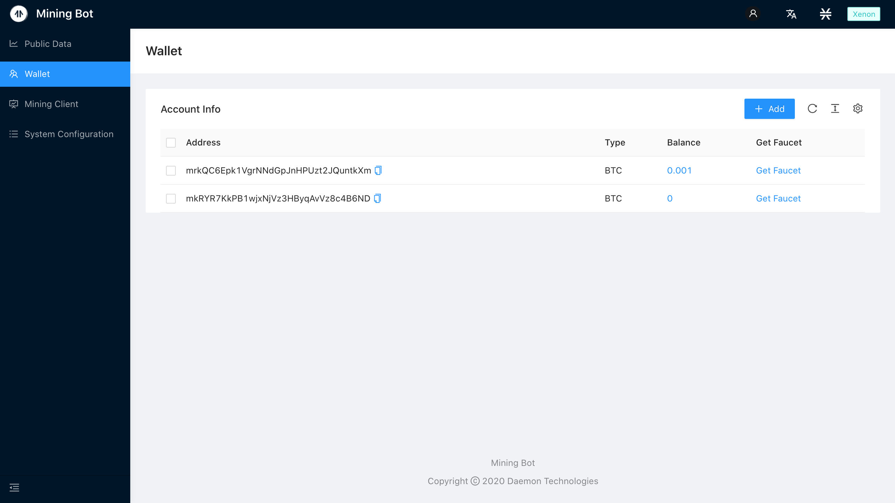


Get BTC testnet coins: https://testnet-faucet.mempool.co/

**Note**: Switch the network to the **Xenon** test network, the current test network is displayed in the upper right corner of the page.


## 3. Client interface

Enter the client page and see that the current state is Mining-Local Server is running, but the `stacks-node` program is not found.


 

### 3.1 Download stacks-node

Click the download `stacks-node` button and wait for the download.

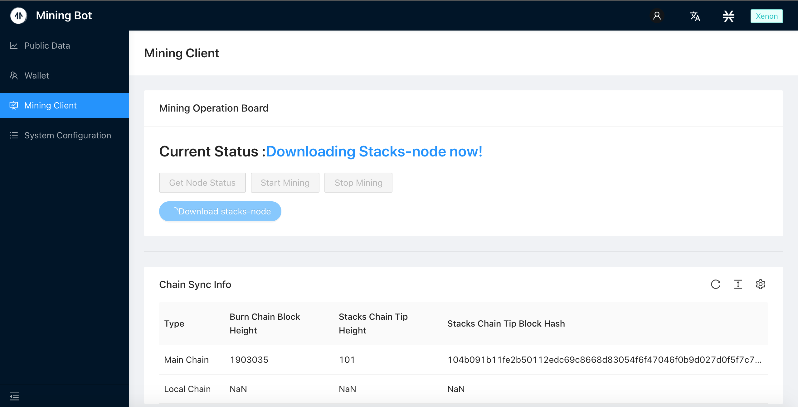


After the download is complete, the status changes to meet the mining conditions:

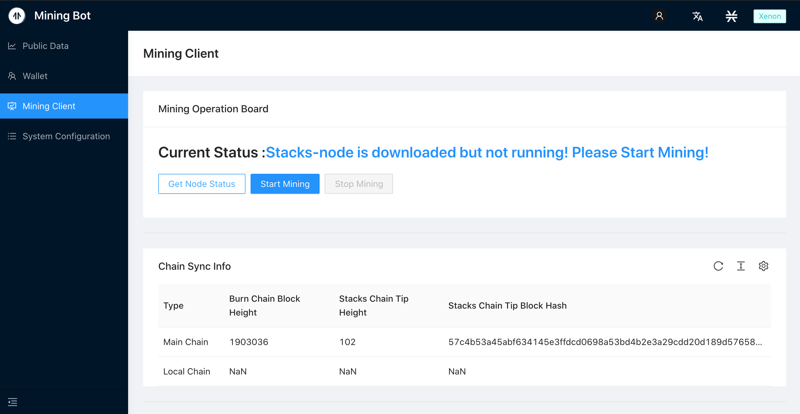


### 3.2 Start Mining:

Account Selection:

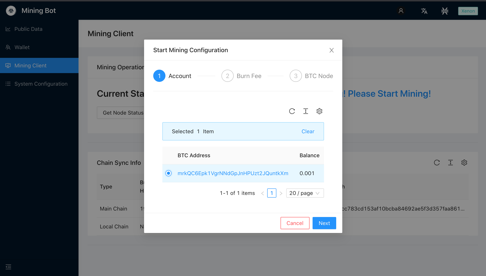


Burn fee setting and whether to open Debug mode:

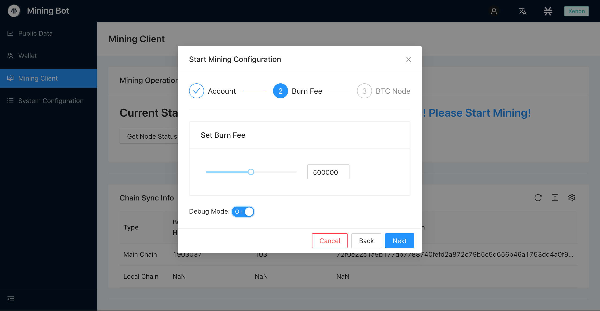


Open Debug mode, you can see more output information on the command line interface after mining starts.

Configure the BTC node information to be synchronized:

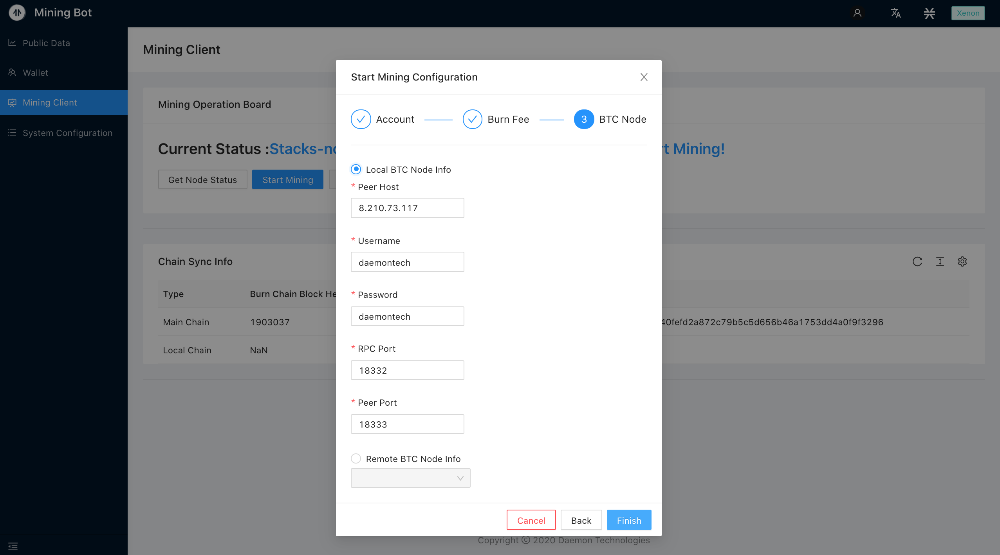


After clicking **Finish**, the authorization password window will pop up:

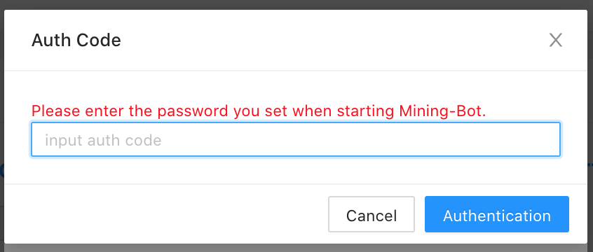


In this example, input: `node1234`, after clicking the **Authentication**, wait a certain time for the interface to automatically jump, and then you can enter the mining.


Check mining status：

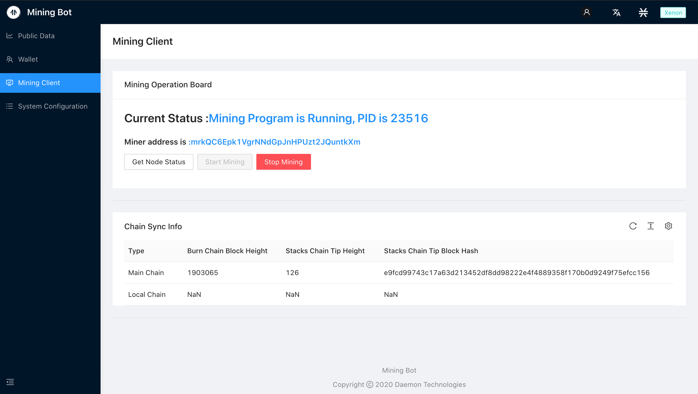


The launch is successful, you can see that the status interface shows your mining address

Server Side Information：

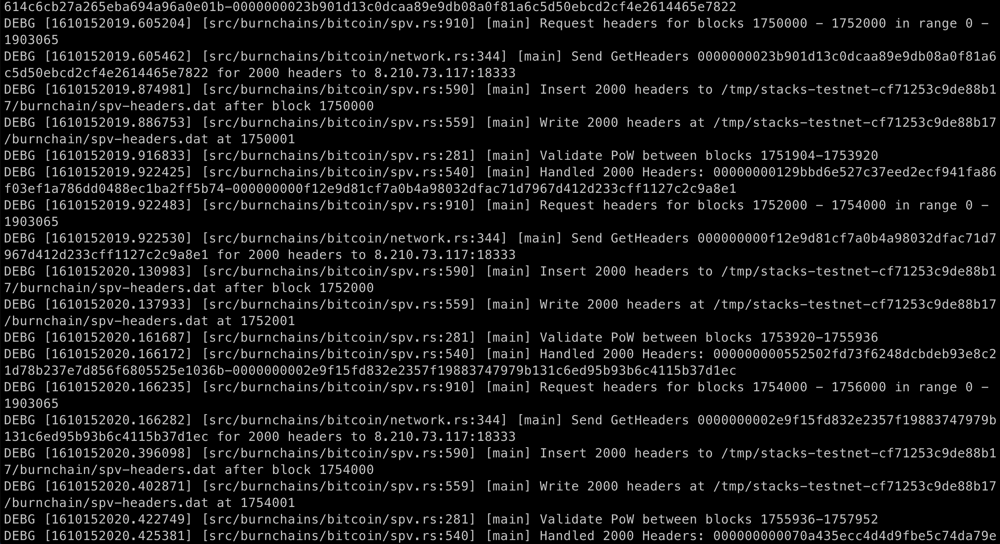


Server side is running.


## 4. System configuration interface

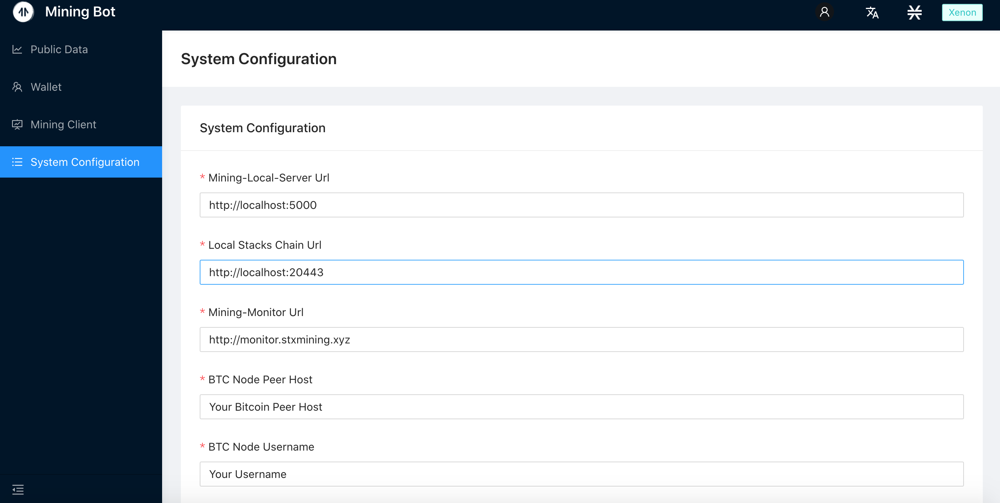


If the network is normal, the information of the main chain and the local chain is displayed. You can configure the information such as Mining-Local-Server, local Stacks chain, BTC node to be synchronized, etc.

When starting the mining configuration Bitcoin node, the local node information is filled in, and it will be updated synchronously in the system configuration interface：


### Reset Lock Password

If you need to reset the information stored locally in Mining-Bot, you can perform a reset operation, which will clear our stored lock password and account information.


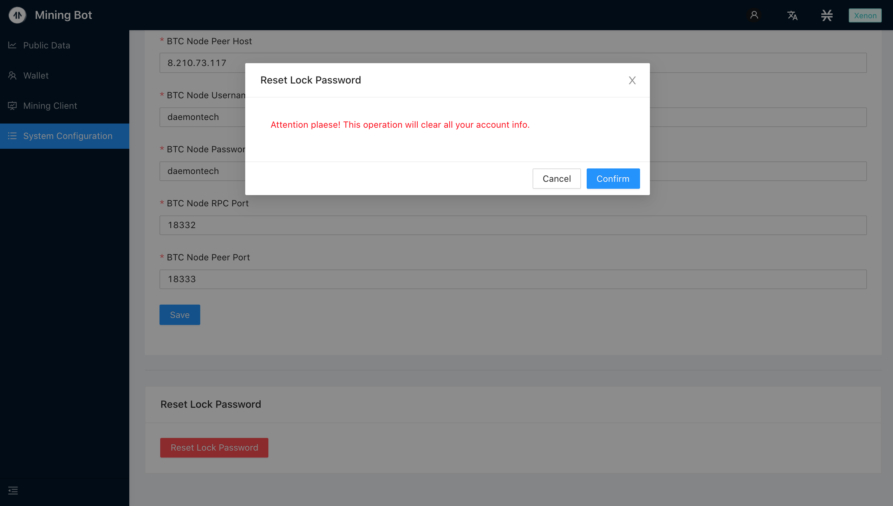


After clicking confirm, it will return to the Set Your Lock Password interface:


The above is all the operations.


